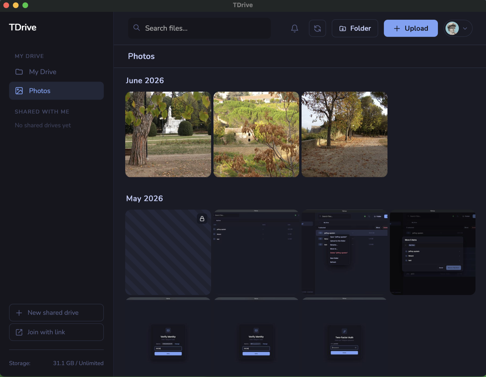
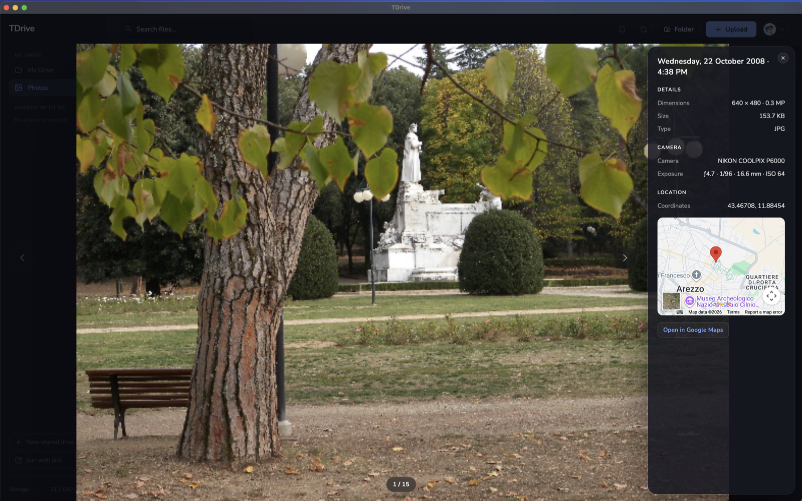
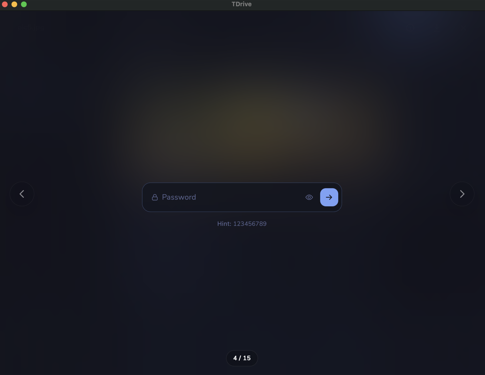
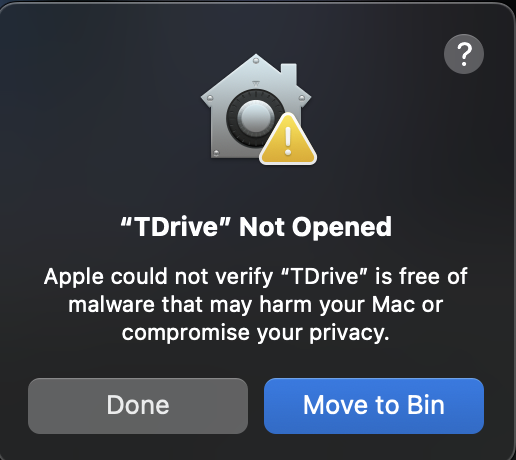
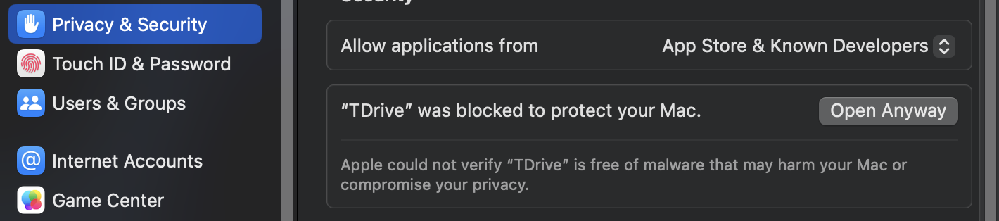

<p align="center">
  
</p>

<p align="center">
  <a href="https://github.com/jeetrex17/TDrive/releases/latest"></a>
  
  
</p>

TDrive is my first Golang project. It uses Telegram as the storage layer: files are posted into Telegram channels/groups, and the app gives you a drive-like UI on top.

This project is for **educational purposes only**. I’m not trying to harm Telegram, abuse their services, or bypass anything, it’s just a learning project to understand Go + Wails + Telegram APIs.

## Screenshots

<table>
  <tr>
    <td></td>
    <td></td>
    <td></td>
  </tr>
</table>

## Features

- **Drives & folders** — a private *My Drive* plus collaborative shared drives, with nested folders, rename, move, and delete.
- **Files larger than 2 GB** — automatically split across multiple Telegram messages and rejoined on download; shown as a single file.
- **End-to-end encryption** — optional per-file encryption on My Drive (XChaCha20-Poly1305); contents are encrypted before they ever reach Telegram.
- **Folder & archive import** — drop whole folders or `.zip` / `.tar` / `.tar.gz` archives; folder structure is recreated and archives can be extracted on the way in.
- **Photos gallery** — browse every image in a drive, newest first.
- **Shared drives** — invite friends with instant or approval-required links; everyone can upload, organize, and see who uploaded what.
- **Cancellable transfers** — cancel uploads and downloads mid-flight, with live size and speed.
- **CLI mode** — use TDrive from the terminal with a local daemon, Linux-like commands, folder/archive upload, shared drives, vault unlock, and progress output.
- **Read-only desktop mount (beta)** — mount the active TDrive from the app or with one CLI command in Finder, Explorer, or Linux Files.

## Download

Grab the latest build for your platform from the [**Releases**](https://github.com/jeetrex17/TDrive/releases/latest) page.

- GUI builds: macOS, Windows, and Linux AppImage.
- CLI builds: macOS and Linux `*-cli.tar.gz` assets, plus a Windows amd64 beta in `*-windows-amd64-cli.zip`.

On first run, enter your Telegram API credentials (see [Telegram API ID + Hash](#telegram-api-id--hash-required) below).

### macOS installation note

If you see a warning saying **"TDrive Not opened because the developer cannot be verified"** this is normal for open source apps not signed with a paid Apple ID ( they ask for 99$/yr certificate and i aint got that money to spent it on that).

Example of the popup :



**To fix this:**

1.  Try to open **TDrive** (click "OK" on the error popup).
2.  Open your Mac's **System Settings** (or System Preferences).
3.  Go to **Privacy & Security**.
4.  Scroll down to the **Security** section.
5.  Click the **Open Anyway** button.
6.  Enter your password if asked, and click **Open**.

This is what it looks like in **Privacy & Security**:



*(You only need to do this once. Future opens will work normally).*

## How it works

- You login with your Telegram account (phone → code → optional 2FA password).
- **My Drive** is a private Telegram channel owned by you.
- **Shared drives** are Telegram megagroups, so friends can join and upload too.
- Uploading a file = sending it as a Telegram document message.
- Folders, renames, moves, deletes, encryption settings, etc. are stored as small `TDX1|...` metadata messages.
- SQLite is only a local cache. If the cache is wiped, TDrive can rebuild the view from Telegram history.

## Shared drives

Shared drives are usable now, but still new. You can:

- Create a shared drive and invite friends with a link.
- Choose normal instant-join links or approval-required links.
- Approve/reject join requests from inside TDrive.
- Upload, download, rename, move, and delete files.
- Create, rename, move, and delete folders.
- See who uploaded files.

Treat invite links like passwords. Anyone with a normal invite link can join unless you revoke it. If you need tighter control, create an approval-required link.

Folder structure inside a shared drive is collaborative: any member can create, rename, move, or delete folders. Deleting a folder also deletes the files inside it, after a confirmation warning.

## Encryption

Personal-drive encryption is per upload. When you choose encrypted upload, TDrive encrypts the file contents before sending them to Telegram, and decrypts automatically on preview/download after you enter the correct password.

Important details:

- Encryption is for **My Drive only** right now, not shared drives.
- Only file contents are encrypted. File names, folder names, sizes, and metadata are still visible.
- One encryption password protects all encrypted personal files.
- TDrive remembers the password only until you close the app.
- Changing the password does not re-encrypt every file. It re-wraps the same master key, so old encrypted files still work with the new password.
- There is no reset/recovery if you forget the password. The hint can help you remember, but it cannot decrypt anything by itself.

## Telegram API ID + Hash (required)

You need your own Telegram API credentials:
- Get them from: https://my.telegram.org/apps

The app stores these credentials locally after you enter them in the setup screen.

## CLI

The CLI is available for macOS, Linux, and Windows amd64. The Windows build is a portable beta with no installer or background system service.

On macOS or Linux, install from the `*-cli.tar.gz` release asset:

```bash
tar -xzf TDrive-*-cli.tar.gz
cd TDrive-*-cli
./install-cli.sh
```

If the installer updated your shell config, reload it:

```bash
source ~/.zshrc   # or ~/.bashrc
```

Then set up Telegram credentials and log in:

```bash
tdrive setup --api-id YOUR_ID --api-hash YOUR_HASH
tdrive login +15551234567
tdrive whoami
tdrive ls
```

On Windows, extract `*-windows-amd64-cli.zip`, open PowerShell in its `TDrive-<version>-windows-amd64-cli` folder, and run the executable directly:

```powershell
.\tdrive.exe setup --api-id YOUR_ID --api-hash YOUR_HASH
.\tdrive.exe login +15551234567
.\tdrive.exe whoami
```

You can also run `tdrive setup` without flags and enter the API ID + Hash interactively.

Most commands auto-start the local daemon in the background. The daemon keeps the Telegram session, sync state, and unlocked vault key alive while you use CLI commands. The GUI and CLI daemon cannot run at the same time because they use the same Telegram session/backend state; if the GUI is open, the CLI will ask you to close it first.

Common commands:

```bash
tdrive drives
tdrive drive use <name|id>

tdrive pwd
tdrive ls -l
tdrive mkdir -p /Photos
tdrive put photo.jpg /Photos/
tdrive get /Photos/photo.jpg .
tdrive cat /Notes/readme.txt

tdrive mkdir -p /Backups
tdrive put folder /Backups/

tdrive mkdir -p /Imports
tdrive put --extract archive.zip /Imports/

tdrive mv /old /new
tdrive rm -r /folder
tdrive sync
tdrive rebuild

tdrive vault status
tdrive unlock
tdrive vault lock

tdrive mount
tdrive mount status
tdrive mount stop
```

Folder and archive imports require the destination folder to already exist first. Single-file uploads can create or rename the final file path.

The mount beta is read-only. Use the **Mount** button in the app, or close the GUI and run `tdrive mount`; TDrive starts its private localhost WebDAV endpoint, attaches it to the current OS, and pins that drive until you disconnect it. Personal drives appear as **Tdrive personal** on macOS, Windows defaults to `T:`, and Linux uses the current desktop GVfs/GIO session. Linux desktop mounts require GIO, GVfs, and the GVfs WebDAV backend, such as `gvfs-backends` on Debian/Ubuntu. Plaintext single-part and multipart files stream from Telegram as they are read. Creating, editing, deleting, and opening encrypted files through the mount are not supported yet. Windows' built-in WebDAV client defaults to a 50,000,000-byte file-size limit, so larger files require changing that OS setting.

Shared drive commands:

```bash
tdrive drive create "Team Drive"
tdrive drive link
tdrive drive join <invite-link>
tdrive drive requests
tdrive drive approve <user-id>
tdrive drive deny <user-id>
tdrive drive leave <name|id>
```

Remove a CLI installed by the macOS/Linux installer:

```bash
tdrive uninstall-cli
```

## Build from source

```bash
wails dev      # run in development
wails build    # build a release binary
go build -o tdrive ./cmd/tdrive  # build the CLI
```

You’ll need your own Telegram API credentials (see above) the first time you run it.

## Where data is stored (local files)

Persistent local files are stored inside your OS “user config” folder under a `TDrive` directory:

- macOS: `~/Library/Application Support/TDrive/`
- Linux: `~/.config/TDrive/`
- Windows: `%AppData%\\TDrive\\`

Files you’ll see there:
- `imp_config.json` → Telegram API ID + Hash (from the setup screen)
- `session.json` → Telegram login session
- `config.json` → Drive channel id (`channel_id`)
- `tdrive.db` → Local cache for channels, folders, files, sync log, and encryption metadata
- `cli.json` → CLI current drive and per-drive working directory
- `daemon.log` → CLI daemon log
- `backend.lock` → Prevents the GUI and CLI daemon from using the backend at the same time

The CLI daemon socket is runtime-only and lives under `$XDG_RUNTIME_DIR` or `/tmp/tdrive-<uid>` on Unix-like systems, not in the config folder. On Windows, the daemon instead uses a per-user named pipe with a protected access list restricted to the current Windows SID; there is no filesystem socket path.

## Notes & caveats

**TDX metadata.** You will see `TDX1|...` messages in Telegram. They are silent but visible, and they are how TDrive remembers the drive structure. Don’t edit or delete them from the regular Telegram app. Changing them can desync what different members see.

**CLI status.** Release assets support macOS, Linux, and Windows amd64; the Windows CLI is a portable beta zip without an installer or system service. The GUI and CLI daemon are mutually exclusive: close the GUI before using CLI commands. `tdrive unlock` keeps the vault key only in daemon memory, and `tdrive cat` may stage decrypted content through a temporary file before writing it to stdout. Folder/archive import is copy-style import, not sync/merge; importing the same folder again can create names like `folder (2)`.

**Download counts.** The downloads badge shows total GitHub release asset downloads. For a per-release/per-OS breakdown:

```bash
./scripts/release-downloads.sh
./scripts/release-downloads.sh v1.0.0
```

This uses GitHub's release asset download counts through the `gh` CLI. It does not track active users.

**A note on AI.** I used AI to help with the frontend UI/styling and planning while i focused more on learning the Go + Telegram side , and also used it for few functions like upload coz i wasnt understanding anything from offical docs lol.

## License

See [LICENSE](./LICENSE).
