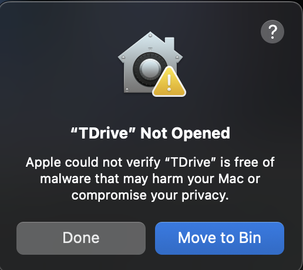
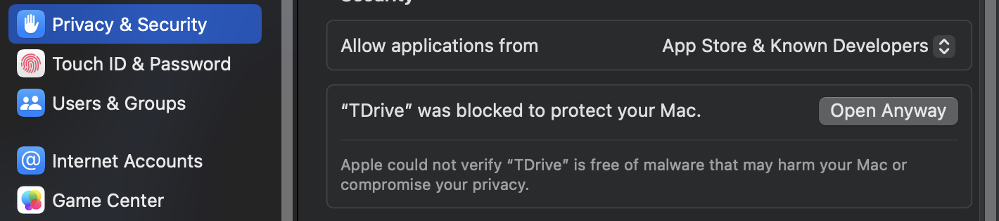
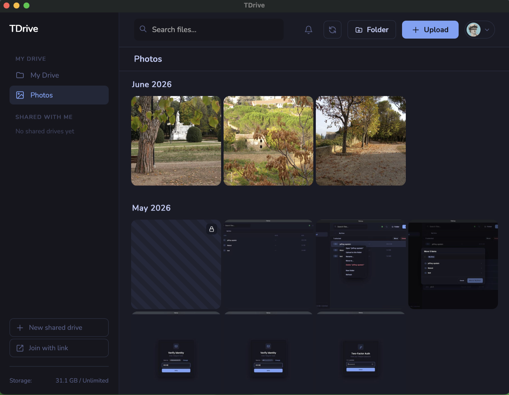
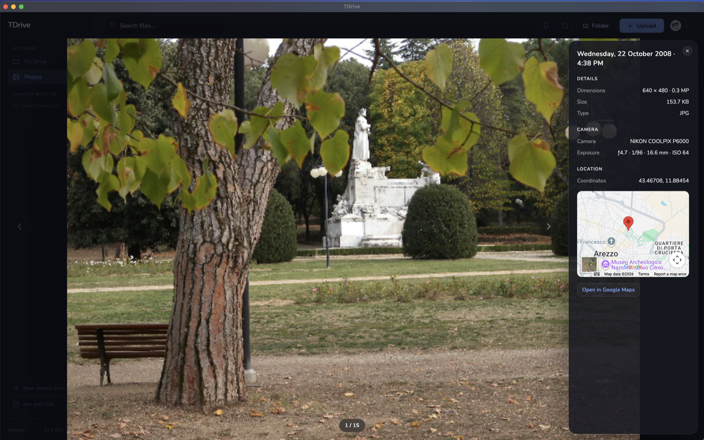
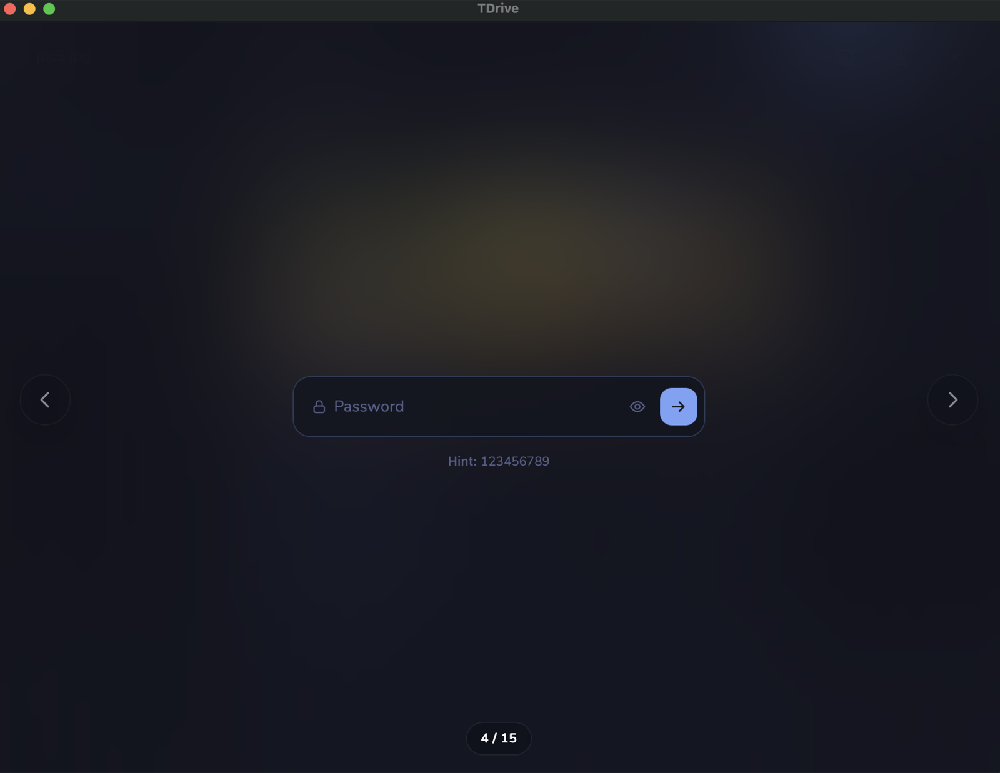

<p align="center">
  
</p>

<h1 align="center">TDrive</h1>

<p align="center">
  <a href="https://github.com/jeetrex17/TDrive/releases/latest"></a>
  <a href="https://github.com/jeetrex17/TDrive/actions/workflows/ci.yml"></a>
  <a href="LICENSE"></a>
  <a href="https://github.com/jeetrex17/TDrive/releases"></a>
</p>

<p align="center">
  <strong>Your files, organized around your own Telegram account.</strong>
</p>

<p align="center">
  A desktop and mobile file manager with media streaming, encrypted photo and video backup, shared drives, and a scriptable CLI.
</p>

<p align="center">
  <a href="https://github.com/jeetrex17/TDrive/releases/latest"><strong>Download TDrive</strong></a>
  &middot; <a href="#quick-start">Get started</a>
  &middot; <a href="#features">Features</a>
  &middot; <a href="#photo-and-video-backup">Photo backup</a>
  &middot; <a href="#command-line-interface">CLI and agents</a>
  &middot; <a href="#build-from-source">Build</a>
</p>

> [!IMPORTANT]
> TDrive is an independent educational project and is not affiliated with Telegram. Use it responsibly and follow Telegram's terms. Do not treat Telegram or TDrive as the only copy of irreplaceable data.

## Download

Download packages from [**GitHub Releases**](https://github.com/jeetrex17/TDrive/releases/latest), not from unofficial mirrors. Open the release's **Assets** list and choose the package for your device.

| Platform | App package | CLI | Distribution |
| --- | --- | --- | --- |
| macOS Apple silicon | `*-macos-arm64.zip` | `*-darwin-arm64-cli.tar.gz` | GitHub Releases |
| Windows amd64 | `*-windows-amd64-setup.exe` or portable `.zip` | `*-windows-amd64-cli.zip` | GitHub Releases |
| Linux amd64 | `*-x86_64.AppImage` | `*-linux-amd64-cli.tar.gz` | GitHub Releases |
| Android ARM64 | `*-android-arm64.apk` when published | Not available | GitHub only, not the Play Store |
| iOS | No public download yet | Not available | Source builds only |

The Windows installer runs per user without administrator rights. The portable zip contains the same application without the installer.

Linux AppImages require glibc 2.35 or newer (Ubuntu 22.04 or a compatible distribution). For the first upgrade from v2.0.0 or earlier, download `TDrive-v2.0.1-x86_64.AppImage` manually, make it executable, and launch it. Earlier versions' in-app updater expects the old filename; v2.0.1 recognizes the new name for subsequent updates. Your existing account and drive data are retained.

### Android installation

1. Download the signed ARM64 APK from a release that includes it.
2. Open the APK and allow installation from your browser or file manager if Android asks.
3. Install TDrive, then follow [Quick start](#quick-start).

Updates are manual: download a newer APK from GitHub and install it over the existing release build. Official release updates use the same signing certificate.

<details>
<summary><strong>macOS first-launch warning</strong></summary>

TDrive is not notarized by Apple. If macOS cannot verify the developer, proceed only after checking that you downloaded the app from this repository's releases and trust it.

1. Try opening TDrive and dismiss the warning.
2. Open **System Settings > Privacy & Security**.
3. Under **Security**, select **Open Anyway**.
4. Authenticate and confirm **Open**.

This adds an exception for the app; it does not require disabling Gatekeeper. See [Apple's explanation of these warnings](https://support.apple.com/en-gb/102445).

<p align="center">
  
  
</p>

</details>

## Quick start

1. Install the app for your platform.
2. Create your own Telegram **API ID** and **API hash** at [my.telegram.org/apps](https://my.telegram.org/apps). Telegram provides [setup instructions](https://core.telegram.org/api/obtaining_api_id).
3. Enter those credentials in TDrive's setup screen.
4. Sign in with your phone number, Telegram login code, and 2FA password if enabled.
5. Choose the Telegram channel containing your existing **My Drive**, or create a new empty drive if this is your first setup.
6. Upload a file, create a folder, open the gallery, or join a shared drive.

TDrive stores your API credentials locally; it does not ship a shared project-wide Telegram credential. Keep the API hash, login session, and vault password private.

**Already use TDrive on another device?** Sign into the same Telegram account and select the same personal-drive channel. If encryption is configured, unlock it with your existing vault password. A new device does not need a new encryption password for that drive.

## Screenshots

<table>
  <tr>
    <td width="33%"></td>
    <td width="33%"></td>
    <td width="33%"></td>
  </tr>
  <tr>
    <td align="center">Gallery</td>
    <td align="center">File viewer</td>
    <td align="center">Encrypted file unlock</td>
  </tr>
</table>

## Features

### Store and organize

- A private **My Drive** plus collaborative shared drives.
- Nested folders with rename, move, drag-and-drop, search, and delete.
- Files larger than 2 GB, automatically split across Telegram messages and presented as one file.
- Recursive folder downloads with transactional publishing to the destination.
- Light and dark themes on desktop and mobile.

### Import and transfer

- Upload files or whole folders from the desktop app or CLI.
- Import `.zip`, `.tar`, and `.tar.gz` archives, with optional extraction.
- Drop files and folders from the operating system directly into TDrive.
- Concurrent uploads, cancellable transfers, progress, speed, and resilient retries.
- Desktop uploads of unencrypted files larger than 1,900 MiB can resume from confirmed Telegram parts after an interruption. TDrive verifies the original source before continuing and safely checks or retries an uncertain final publish. Smaller and encrypted uploads keep their existing behavior.

### Preview and stream

- Browse photos in a drive-wide gallery.
- Preview images, PDF, text, code, audio, and video without leaving the app.
- Stream media directly from Telegram, including encrypted personal-drive media.
- Desktop mpv playback for formats the system webview cannot decode, including MKV and HEVC.
- Audio-track, subtitle, playback-speed, picture-fit, and subtitle-appearance controls.
- Drag or swipe the video timeline to seek. Available codecs and playback controls depend on the platform and player.

### Back up photos and videos

- Encrypted backup to **My Drive** from selected desktop folders or folders on Android device storage.
- A persistent queue with pause, resume, retries, and upload progress.
- Original files stay on your device. See [Photo and video backup](#photo-and-video-backup) for permissions and background limits.

### Share and collaborate

- Shared drives backed by Telegram megagroups.
- Instant-join or approval-required invite links.
- Join-request approval and uploader attribution inside TDrive.
- Collaborative file and folder organization for drive members.

### Mount and automate

- Mount TDrive in Finder, Explorer, or a Linux file manager through a private local WebDAV endpoint.
- Personal drives are read/write, including encrypted content; shared drives are read-only.
- Use the CLI for terminal workflows, scripts, imports, vault access, synchronization, and mounts.
- Interrupted personal-drive writes are journaled and recovered safely.

### Protect and recover

- Optional client-side XChaCha20-Poly1305 encryption for personal-drive file contents.
- Live synchronization while Telegram activity arrives.
- Local SQLite state can be rebuilt from Telegram history after cache or configuration loss.

<details>
<summary><strong>Desktop keyboard navigation</strong></summary>

- **Up/Down/Home/End** move focus in the file grid.
- **Space** selects or toggles a row; **Shift + Space** selects a range.
- **Enter** opens a folder, previews a file, or downloads it when no preview is available.
- **Right** enters row actions; **Left** or **Escape** returns to the row.
- **F2**, **Delete**, **Menu**, or **Shift + F10** opens the selected row's action menu.
- Dialogs keep focus inside the active dialog and restore it when closed.

</details>

## Photo and video backup

Open **Photo & video backup** from the desktop account menu or the Android **Account** tab. Choose your folders and start backup. Files go into `Photo backup / <device> / <source>` inside **My Drive**, under your selected destination parent if configured.

| Device | Sources |
| --- | --- |
| Desktop | Selected local folders, including subfolders |
| Android | Permitted photos and videos in selected folders on device storage |
| iOS source build | Backup source selection is not available |

Backup is encrypted and personal-drive-only. It reuses your drive's existing vault: unlock it with the same password used on your other devices. If that drive has no vault yet, TDrive asks you to set one up.

Backup never deletes device originals. Removing a source does not delete files already uploaded to TDrive. Pause, queue state, and confirmed uploads are remembered across restarts.

Mobile permissions determine which media TDrive can see. Discovery runs while the app is active; an in-flight upload may continue with a native background allowance. Backup is not a continuously scheduled uploader and cannot continue after the app process is terminated. Keep the app open for the initial backup of a large library.

For the detailed recovery, staging, and platform limits, see the [backup documentation](backend/photobackup/README.md).

## How it works

1. **My Drive** is a private Telegram channel owned by you.
2. **Shared drives** are Telegram megagroups whose members can collaborate.
3. File bodies are sent as Telegram document messages. Large files use multiple immutable parts.
4. Folders, moves, renames, deletes, policies, and encryption information are represented by small `TDX1|...` metadata messages.
5. SQLite is a rebuildable local projection of that Telegram-backed state. TDrive replays Telegram history to synchronize or recover it.

> [!WARNING]
> `TDX1|...` messages are part of the drive history. Do not edit or delete them in the Telegram app; doing so can damage or desynchronize the projected filesystem.

## Privacy and encryption

Manual uploads on **My Drive** can use client-side XChaCha20-Poly1305 encryption. Photo and video backup always uses encryption. TDrive encrypts file contents before sending them to Telegram and decrypts them after the correct vault password is entered.

Important limits:

- Encryption currently applies to personal-drive file contents, not shared drives.
- File names, folder names, sizes, Telegram relationships, and operational metadata remain visible.
- Encrypted streams detect modification and truncation, but the current format does not authenticate namespace/control metadata or bind an entire ciphertext object to one filename.
- One vault password protects the encrypted personal files. It stays in memory only until the app or CLI daemon exits or the vault is locked.
- Changing the password re-wraps the existing master key; it does not re-encrypt every stored file.
- There is no password reset. The optional hint cannot decrypt content.

## Shared drives

Shared drives support file and folder upload, download, rename, move, and delete. Members can see who uploaded a file and can organize the shared namespace.

Invite links should be treated like passwords. Use approval-required links when membership needs review, and revoke links that should no longer grant access.

Deleting a shared folder also deletes its contained files after confirmation. Shared drives mount read-only even though they remain writable through the app and CLI.

## Command-line interface

The CLI is available for macOS, Linux, and Windows amd64. Most commands automatically start a local daemon that keeps the Telegram connection, sync state, and unlocked vault key warm between commands.

The GUI and CLI daemon cannot use the same backend state simultaneously. Close the GUI before using CLI commands; the CLI reports this conflict instead of starting a second backend.

### Install on macOS or Linux

Download and extract the CLI archive for your platform. Open a terminal in the extracted `TDrive-...-cli` directory, then run:

```bash
./install-cli.sh
```

Reload the shell if the installer updated its configuration, then set up and log in:

```bash
tdrive version
tdrive setup --api-id YOUR_ID --api-hash-stdin
tdrive login +15551234567
tdrive whoami
tdrive ls
```

### Run on Windows

Extract the `*-windows-amd64-cli.zip` release asset and run `tdrive.exe` from PowerShell:

```powershell
.\tdrive.exe setup --api-id YOUR_ID --api-hash-stdin
.\tdrive.exe login +15551234567
.\tdrive.exe whoami
```

### Common commands

```bash
tdrive drives
tdrive drive use <name|id>
tdrive ls -l
tdrive mkdir -p /Photos
tdrive put photo.jpg /Photos/
tdrive get /Photos/photo.jpg .
tdrive mkdir -p /Imports
tdrive put --extract archive.zip /Imports/
tdrive mv /old /new
tdrive rm -r /folder
tdrive sync
tdrive rebuild
tdrive unlock
tdrive mount
tdrive mount status
tdrive mount stop
```

Folder and archive imports require the destination folder to exist. Single-file uploads can create or rename the final file path.

Shared-drive commands include `drive create`, `drive link`, `drive join`, `drive requests`, `drive approve`, `drive deny`, and `drive leave`. Run `tdrive help` or `tdrive <command> --help` for the complete command reference.

### Automation and agent use

Start with the offline version and command manifest. Neither needs a daemon or Telegram connection. `tdrive commands --json` is the authoritative list of JSON-supported commands, flags, and mutation behavior.

```bash
tdrive version --json
tdrive commands --json
```

After interactive setup and login, use JSON output and explicit drive IDs for scripts:

```bash
tdrive drives --json
tdrive ls /Photos --drive-id 123456789 --json --non-interactive
tdrive put photo.jpg /Photos/photo.jpg --drive-id 123456789 --json --non-interactive
```

Use the numeric drive ID returned by `tdrive drives --json`, replacing the example ID above. Drive-scoped JSON commands require `--drive-id` and canonical absolute remote paths. They do not change the daemon's shared active drive or working directory, so concurrent scripts can target different drives safely. Human-readable output remains the default; `--json` (or `--output json`) is opt-in and rejects unsupported commands.

<details>
<summary><strong>JSON contract, exit codes, and automation limits</strong></summary>

Each successful JSON command writes one schema-versioned object to stdout (`schema_version`, `ok`, `command`, `data`), with no progress text. An error writes one object to stderr (`schema_version`, `ok: false`, `error` with `code`, `message`, `retryable`, and optional `hint`). Branch on `error.code`, not the message.

| Exit code | Meaning |
| --- | --- |
| `0` | Success |
| `1` | Other operation failure |
| `2` | Invalid or unsupported command |
| `3` | Required input or authentication |
| `4` | Not found |
| `5` | Conflict or required confirmation |
| `6` | Timeout or unavailability |

- `--non-interactive` never prompts. Vault unlock requires `--password-stdin` in JSON or non-interactive mode.
- JSON `rm` and `rebuild` require `--yes`. Non-interactive text mode also requires it for destructive drive actions and full logout. There is no dry-run option.
- JSON `put` accepts one regular local file. JSON `get` requires an explicit local file path and refuses to overwrite it unless `--yes` is given. The no-clobber check is best-effort, not atomic with other writers.
- Interactive Telegram login is still required, and setup is text-only. `setup --api-id ID --api-hash-stdin` avoids putting the API hash in shell history or process arguments.
- `--timeout 30s` bounds a daemon RPC after startup, not daemon startup itself.
- `cat` emits raw file bytes and does not support JSON. It verifies downloads in a private temporary directory before writing them to stdout; a crash can leave plaintext there.

</details>

## Desktop mount

Use **Mount** in the app, or close the GUI and run `tdrive mount`. TDrive starts a private localhost WebDAV endpoint and attaches the selected drive to the operating system until it is ejected.

If the selected encrypted drive is locked, the CLI prompts for its existing vault password and retries the mount. Scripts can supply the password through stdin with `tdrive mount --password-stdin --non-interactive`; mount start does not support JSON mode.

- **macOS:** appears in Finder as **Tdrive personal**.
- **Windows:** defaults to drive `T:`. Windows WebDAV has a default 50,000,000-byte file-size limit that must be changed in the OS for larger files.
- **Linux:** uses the active GIO/GVfs desktop session and requires the GVfs WebDAV backend, such as `gvfs-backends` on Debian or Ubuntu.

Personal-drive mounts support create, replace, rename, move, and delete. Encrypted writes are staged as ciphertext before Telegram commit. Encrypted uploads require a known content length. Shared-drive mounts remain read-only.

Linux mount behavior depends on the desktop's GIO/GVfs integration and should still be treated as beta.

## Known limitations

- TDrive depends on Telegram availability, account access, API behavior, and rate limits.
- It is not a substitute for keeping an independent backup of important files.
- Shared-drive mounts are read-only.
- The Windows CLI is a portable beta without an installer or background system service.
- Folder and archive import is copy-style import, not synchronization or merge; importing the same folder repeatedly may create numbered names.
- `tdrive cat` may stage decrypted content in a temporary file before writing it to standard output.
- Mobile backup stages originals locally, requires available device storage, and rejects resources larger than 4 GiB. It cannot keep running after the app process is terminated.
- Backup does not deduplicate content across devices or mirror cloud albums. Album and whole-library backup sources are not available.
- iOS can be built from source but has no public App Store, TestFlight, or installable release download yet.

## Build from source

Use the Go version declared in [go.mod](go.mod), Node.js 22 with npm, and the pinned Wails v3 CLI below. Install the native dependencies for your platform first; see the [build guide](build/README.md) and [Wails installation guide](https://v3.wails.io/getting-started/installation/).

Run these commands from the repository root:

```bash
go install github.com/wailsapp/wails/v3/cmd/wails3@v3.0.0-beta.22

# Dependencies and embedded frontend
npm --prefix frontend ci
npm --prefix frontend run build

# CLI
go build -o build/bin/tdrive ./cmd/tdrive

# Desktop development/build
wails3 dev
wails3 task build      # binary only, into build/bin
wails3 task package    # + platform packaging (.app / NSIS installer / AppImage)
```

Android and iOS build commands are in the [mobile build guide](build/README.md#mobile).

<details>
<summary><strong>Run checks and tests</strong></summary>

After installing the platform build dependencies, run from the repository root:

```bash
go test ./...
go vet ./...
npm --prefix frontend run typecheck
npm --prefix frontend run lint
npm --prefix frontend run test:coverage
npm --prefix frontend run build
bash scripts/test-android-version-code.sh
bash scripts/test-android-signer-digests.sh
```

On Linux, add `-tags=gtk3` to Go build, test, and vet commands to match this project's desktop configuration.

Browser tests run from `frontend/`:

```bash
npx playwright install --with-deps chromium webkit
npm run test:e2e
npx playwright test --config playwright.gallery-webkit.config.ts
```

</details>

Native playback packaging is handled by the scripts under `scripts/` and the release workflow. When a bundled runtime is unavailable, TDrive can fall back to `mpv` from `PATH`; `TDRIVE_MPV_BIN` overrides that binary.

<details>
<summary><strong>Local data locations</strong></summary>

Desktop persistent files live in the operating system's user-config directory:

- macOS: `~/Library/Application Support/TDrive/`
- Linux: `~/.config/TDrive/`
- Windows: `%AppData%\TDrive\`

Important files include:

- `imp_config.json`: Telegram API ID and hash
- `session.json`: Telegram login session
- `config.json`: personal-drive channel configuration
- `tdrive.db`: local projection, sync log, and encryption metadata
- `photo-backup.db`: backup sources, settings, and queue
- `cli.json`: CLI drive and working-directory state
- `daemon.log`: CLI daemon log
- `backend.lock`: prevents concurrent GUI and daemon ownership

The Unix daemon socket is runtime-only under `$XDG_RUNTIME_DIR` or `/tmp/tdrive-<uid>`. Windows uses a per-user named pipe restricted to the current Windows SID.

Mobile builds use app-private storage. Configuration and session files contain sensitive account data; do not attach them to public bug reports.

</details>

## Project background

TDrive began as my first Go project and a way to learn Go, Wails, and Telegram APIs. I used AI to help with frontend styling, planning, and some implementation areas where the Telegram documentation was difficult, while focusing my learning on the Go and Telegram side.

## Releases and support

- [Latest release](https://github.com/jeetrex17/TDrive/releases/latest)
- [All release notes](https://github.com/jeetrex17/TDrive/releases)
- [Telegram community](https://t.me/Tdrive_community): questions, feedback, and discussion
- [Report a problem](https://github.com/jeetrex17/TDrive/issues)

For bug reports, include the TDrive version, operating system, expected behavior, and steps to reproduce. Redact API hashes, passwords, session data, private filenames, and invite links from logs and screenshots.

## Star history

<a href="https://www.star-history.com/?repos=jeetrex17%2FTDrive&type=date">
  <picture>
    <source media="(prefers-color-scheme: dark)" srcset="https://api.star-history.com/chart?repos=jeetrex17/TDrive&type=date&theme=dark" />
    <source media="(prefers-color-scheme: light)" srcset="https://api.star-history.com/chart?repos=jeetrex17/TDrive&type=date" />
    
  </picture>
</a>

## License

TDrive is licensed under the [MIT License](LICENSE).
