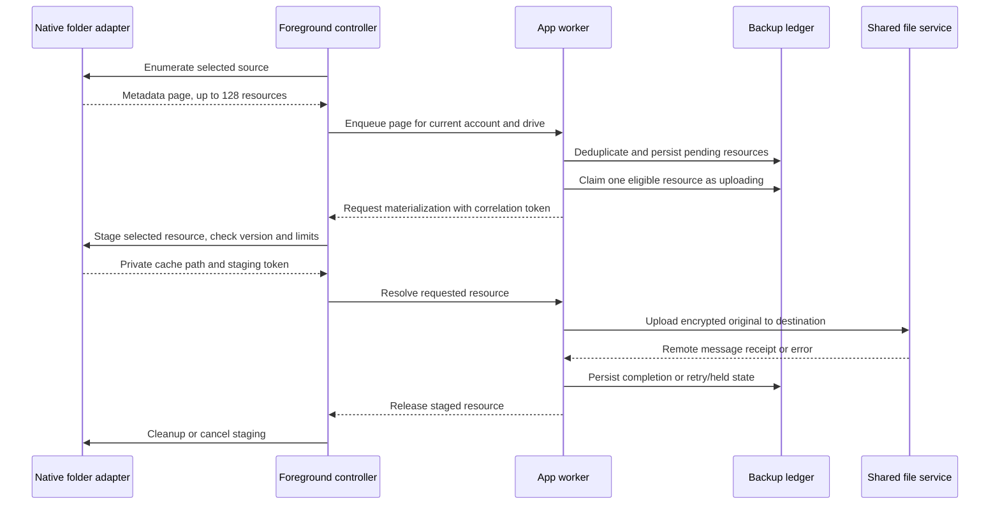

# Photo and video backup

The backup ledger is separate from the gallery cache and the remote file index.
It records user-selected sources, discovered media versions, and confirmed
upload receipts in `photo-backup.db`, scoped by authenticated account and drive.
The app resolves that scope; native adapters cannot choose an account.

Current app backup is restricted to **My Drive and encrypted uploads**. The
[access gate](../../app_photo_backup_access.go) validates the personal drive;
[uploadPhotoBackup](../../app_photo_backup.go) forces encryption even for work
queued by older builds. A legacy settings value cannot enable plaintext backup.

## Execution

- Desktop scans selected folders while TDrive runs. Reconciliation runs at a
  bounded interval and after starting backup. A scan uses `ReadDir(128)` with a
  bounded directory stack, excludes application data, and skips symlinks.
- Android reads authorized MediaStore images/videos through native paged
  queries. iOS reads media files in user-selected folders through the system
  document picker and persisted bookmarks. Neither adapter reads other
  applications' private files without a user-granted access path.
- An Android folder source is a place, not a document tree. The system picker
  chooses the folder; the tree it returns is converted to a media volume and a
  path on it, and the folder is then read through the same paged MediaStore
  query. Nothing holds a URI permission, so a folder source cannot be lost to a
  revoked tree grant. Media permissions still determine which items can be read.
  Such a source covers the photos and videos MediaStore indexes, not every
  file in the folder, and only folders on the device's own storage: one from a
  cloud provider is refused where it is picked. Overlapping folders are refused
  because both would dedupe to one upload whose destination
  depended on scan order. iOS uses a different mechanism: the folder picker
  retains a bookmark and opens its security scope when accessing the folder.
  A missing or unresolvable bookmark makes that source unavailable.
  Only `folder` and `device-folder`
  sources are accepted; retired album and whole-library sources and their
  unfinished work are removed on startup. Completed receipts and uploaded files
  are kept.
- The frontend enumerates mobile sources a page at a time. The Go worker
  uploads one queued resource at a time using the shared file service. Opening
  the gallery does not start an original-library download.
- Mobile discovery runs while the app is active. With a native execution grant,
  an in-flight transfer can continue after backgrounding. Android uses a visible
  data-sync foreground service; iOS grants limited UIKit background time, with a
  conservative Go cancellation deadline. New resources wait for the foreground
  because materialization still needs the WebView. This does not provide a
  headless OS-scheduled uploader or uploads after process termination. Apple's
  background HTTP upload transport is not wired to Telegram.

The app owns scheduling and policy; this package owns discovery checkpoints,
job state and receipts. Mobile bytes cross the native bridge only when requested
for the current job:

Settings and queue state survive restart. Desktop scan handles do not: an
interrupted traversal performs a fresh linear scan, with the ledger suppressing
already discovered versions. Mobile discovery may also reconcile accessible
sources again after resume. Desktop and Android page their traversal/query work.
iOS has the separate snapshot bound below; none promises constant-time discovery for a million items.

Pause cancels in-flight work and persists per account and drive. Only an explicit
Resume clears that choice; settings changes, retries, and app restarts do not.
Cancellation without a remote receipt holds the interrupted item for explicit
retry because its remote outcome may be uncertain. Confirmed receipts remain
complete even if cancellation arrives at the same time. Pausing does not spend
the item's failure retry budget.

## Identity and completion

Native identity is account/drive + asset ID + version + resource ID. Repeated
discovery of the same resource does not duplicate its upload. A completed
receipt remains useful after its original source selection is removed.
Desktop identity uses the selected source and relative file path/version.

[`RunOnce`](engine.go) claims at most one job. Ordinary failures enter `error`
with exponential backoff (default base: one minute); reaching the default eight
attempts moves the job to `paused`. Explicit Retry resets `error`, `paused` and
`missing` jobs to `pending`, including their attempt counters. This per-job state
is separate from the persisted manual-pause setting, which only Resume clears.

Only a positive remote receipt marks a resource complete. A local file-index
write failure after remote commit retains that receipt; ordinary synchronization
repairs the index. If the process dies while an upload is marked in flight, its
remote outcome is uncertain. Recovery holds it for explicit retry instead of
automatically sending another copy. A retry can duplicate an uncertain upload.
If writing the receipt to the backup ledger itself fails, crash recovery can
still find an ambiguous `uploading` row;
the local file index and the backup receipt are separate persistence steps.

A receipt also stops counting as complete once the drive no longer holds the
file it points at. A sweep checks up to 2,048 receipts before each run in batches
of 256, from a durable cursor that rewinds at the end of a cycle. The
[app comparison](../../app_photo_backup_receipts.go) reads the local drive
projection and trash entries; it does not probe each message directly in Telegram.
A receipt reported absent becomes `missing`: the ledger stops counting it as
backed up and the panel reports it as waiting on the user. That state is never
queued automatically; only explicit Retry sends the file again, preserving a
deliberate deletion until the user chooses otherwise.
A file in the trash is still recoverable and is not a loss, a file that comes
back becomes complete again. IDs above the greatest message ID in the local
file index are deferred.
This frontier guard is not proof that every earlier ID has been indexed: receipt
reconciliation depends on the projection having caught up with remote changes.

A watched folder's subfolders are recreated under its destination. A desktop
walk derives them from the file's own path; a phone has no path to derive them
from, because the bytes are staged in the app's cache, so the host reports the
folder chain with each discovered item and the ledger carries it. Either way
the chain is sanitized component by component before it becomes a folder name.

The current iOS discovery path enumerates selected folders, not the PhotoKit
library or albums. [`TDrivePhotoBridge.inc`](../../build/ios/TDrivePhotoBridge.inc)
stores bookmarks in `NSUserDefaults`, keyed by normalized `files:<path>/` roots.
Each scan/staging access resolves the bookmark and opens a security scope;
stale but resolvable bookmarks are refreshed. A missing bookmark, failed
resolution or denied scope makes the source unavailable.

The first iOS page walks the folder into an in-memory snapshot capped at **50,000
matching media files per source**. Hidden files and package descendants are
skipped. Subsequent pages use a snapshot token plus offset, with at most 128
resources per response; the snapshot is released after its final page. A stale
or lost token requires a new scan. This is response pagination over a retained
listing, not a streaming directory traversal. Files beyond the cap are not
covered by that scan, and there is no continuation beyond the capped snapshot.
There is no compound-asset manifest or Live Photo reconstruction. Cross-device content deduplication and cloud album mirroring
are not implemented.

## Resource limits and deletion

Staging permits one resource at a time, at most 4 GiB. Native adapters also reserve
512 MiB of free device storage. Staging is streamed, version-checked, canceled
when the worker stops, and released after use. Cold launch removes abandoned
native staging. Desktop staging uses a private snapshot to detect source
replacement and cleans it after upload; it currently relies on write errors for
low-disk detection. The existing uploader may use additional bounded encryption or
multipart scratch files. Larger native resources report an error rather than
silently truncating the original.

The durable queue and catalog grow with the library; thumbnails retain their
independent byte-aware LRU limits. Status counts are maintained transactionally
so refreshing progress does not scan the full queue. A scan page never contains
more than 128 resources.

Backup never deletes device originals. Removing a source stops backing it up
without deleting cloud files. Full logout drains the worker and removes the
backup database, its SQLite sidecars, and native staging; soft logout retains the
ledger. Encryption keys are not stored in backup settings. Backup waits for the
existing encryption session.

When encryption is locked, the panel shows the unlock prerequisite before
starting. Explicit start, resume, or retry actions use the existing password
dialog; automatic discovery never opens a password prompt. Canceling the dialog
leaves the operation stopped. Passwords and keys remain session-only.

The ledger is currently schema v6. Sequential migrations add manual pause,
remove charging policy, and add capture time, receipt cursors and relative folder
paths. Backup has no charging condition; migrations preserve supported sources
and jobs, followed by cleanup of retired sources and orphaned unfinished work.

## User-visible limits

Backup source selection offers selected folders on desktop, Android and iOS
when the corresponding native picker is available. Under Android's partial
photo access, MediaStore answers only with the
items the user authorized. Adding a folder requests media access as well as
the folder location. New uploads go to `Photo backup / <device> / <source>` in
My Drive (under a configured destination parent when present). Device names
are persisted with an installation-specific suffix. Indexed folder lookup reuses
the hierarchy across restarts; existing completed uploads are not moved or sent
again. The panel reports the actual destination layout.

A single scoped notification/Transfers row reports the current filename, transport
percentage, bytes, and queue counts. Byte updates are throttled to four per second;
file completion clears the current item. State uses one snapshot, not one object
per queued file, and stale responses cannot restore another drive's filenames.

Encrypted photo backups reuse the uploader's immutable snapshot (up to 30 MiB) to
create encrypted thumbnails and previews before releasing the local source.
A failed optional preview does not invalidate the original upload receipt.
Unlocking encryption immediately retries visible locked thumbnails; offscreen
items remain lazy. Older encrypted images without derivatives can prepare them
on demand, capped at 30 MiB per original and by thumbnail worker concurrency.
Temporary originals stay encrypted on disk and derivatives use the encrypted
cache. Larger or unsupported images may still lack a thumbnail.

Wi-Fi-only policy is supported on Android. A required connectivity report older
than two minutes, or an unavailable report, prevents uploading; other platforms
reject that setting.

The gallery shows supported images and videos together. Video tiles request only
document thumbnails and open the existing streaming player on activation. Missing
thumbnails do not trigger full-video downloads. Unsupported preview formats remain
accessible through the normal file browser/download flow. Device albums are not
mirrored into cloud albums.
Original metadata embedded in the file is retained; the current cloud timeline
still orders files by upload time.

The iOS folder path is implemented in
[TDrivePhotoBridge.inc](../../build/ios/TDrivePhotoBridge.inc), reached through
the [native adapter](../../frontend/src/modules/photo-backup/native-adapter.ts)
and [backup controller](../../frontend/src/modules/photo-backup/controller.ts).
Folder access depends on the selected provider and a valid security scope;
the presence of the bridge does not establish behavior on every physical device.

Tests cover durable recovery, account isolation, resource deduplication, bounded
folder traversal, cancellation, and 100,000-row transactional status counters.
Native compiler checks and mocked frontend journeys do not replace real-device
permission, low-storage, large-library, and restore testing.
