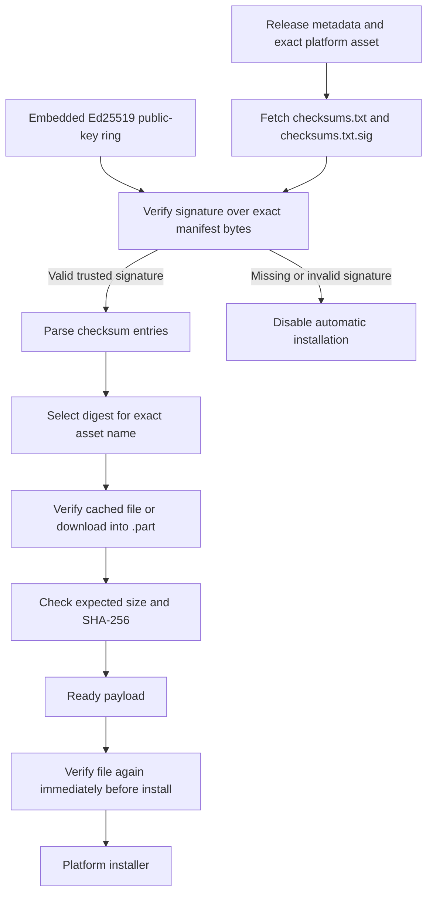
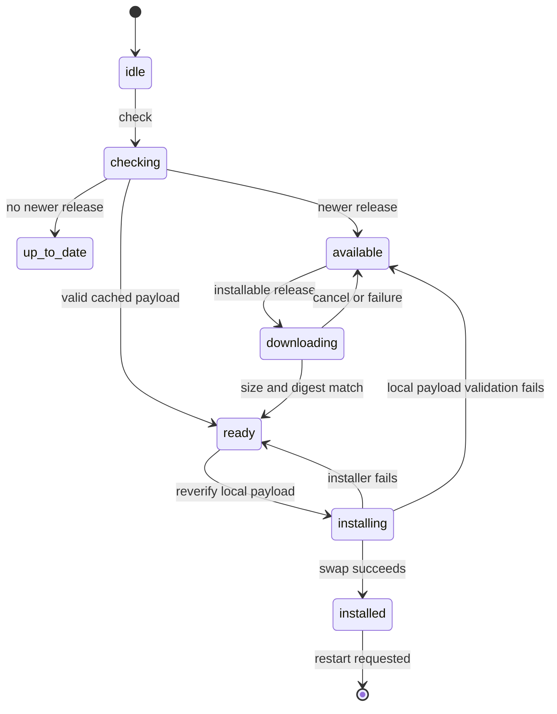
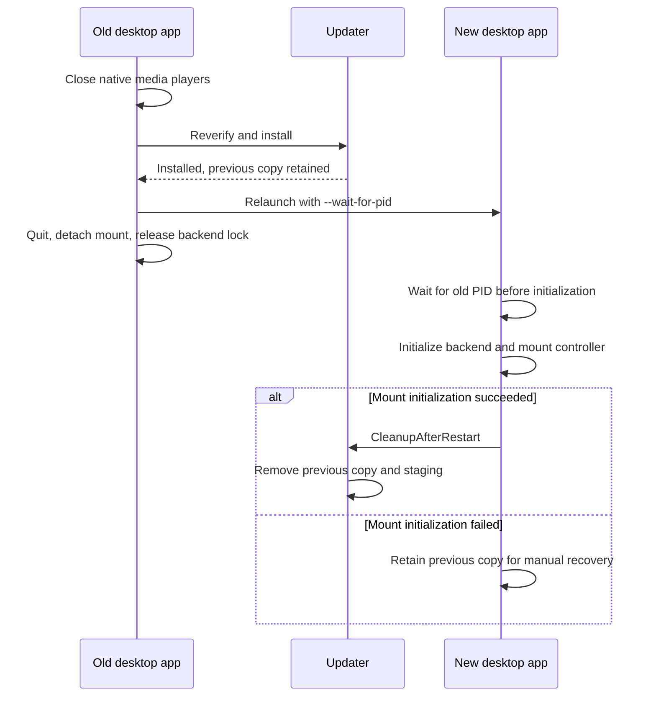

# Desktop update verification and recovery

Desktop updates authenticate a checksum manifest, validate the selected payload,
and replace the running installation while retaining a previous copy. The
[updater service](../../backend/updater/service.go) owns release state;
[UpdateService](../../internal/app/updates.go) connects it to native players, restart and
startup cleanup. Mobile stores own the mobile update path.

Windows processes with package identity, including sideloaded MSIX packages,
also leave the GitHub updater disabled. The Updates panel directs these installs
to Microsoft Store. Runtime identity detection prevents binary replacement and
rollback cleanup in a protected package directory; unpackaged Windows installs
retain the existing update path. See the
[MSIX guide](../../build/windows/store/README.md) for packaging and testing.

## Release discovery and trust

The service asks the [GitHub source](../../backend/updater/github.go) for a
release and compares versions using [semantic version parsing](../../backend/updater/version.go).
A development version that cannot be parsed disables the updater. Initialization
does not itself start network discovery; the frontend owns the check schedule.

Asset selection uses exact names from [platform.go](../../backend/updater/platform.go),
so similarly named CLI archives cannot be selected as desktop payloads.

| Build platform | Asset name for release tag `TAG` |
| --- | --- |
| macOS arm64 | `TDrive-TAG-macos-arm64.zip` |
| Windows amd64 | `TDrive-TAG-windows-amd64.zip` |
| Linux amd64 | `TDrive-TAG-x86_64.AppImage` |

Linux also accepts the older `TDrive-TAG-linux-amd64.AppImage` name when the new
name is absent. Unsupported platforms and missing assets leave the release
visible with a manual-install hint. Automatic installation also needs a writable
installation parent and an available private update cache.

[`manifest_signature.go`](../../backend/updater/manifest_signature.go) defines the
trust root and wire contract:

- Signed bytes are `TDrive update manifest v1\x00` followed by the raw manifest.
  Whitespace or newline normalization changes the signed message.
- Each envelope record is `tdrive-ed25519-v1 KEY_ID BASE64_SIGNATURE`.
  The key ID is lowercase SHA-256 of the public key's PKIX DER encoding.
- The envelope is at most 16 KiB; fetching it has a 15-second timeout.
  Parsing rejects malformed records, carriage returns, blank records and
  duplicate records for a recognized trusted key.
- At least one recognized signature must verify. Unknown key IDs may coexist
  with a valid trusted signature to support rotation overlap.
- Production keys are embedded in the binary. The option to inject keys is an
  unexported test seam; release metadata does not supply a new trust root.

Rotation requires a bridge release that embeds old and new public keys, with
compatible signatures published by the [release workflow](../../.github/workflows/release.yml).
The workflow signs the same domain-separated bytes and validates signing
artifacts against embedded keys. Signing private keys belong in the release
signing environment, never source, logs or test fixtures.

This trust path authenticates payload digests. It is not a signature over every
GitHub release field, nor a guarantee of release freshness or future application
health. Missing or invalid signatures never trigger an unsigned automatic install.

## Download and state ownership

The [download implementation](../../backend/updater/download.go) writes into a
`.part` file, checks expected size and SHA-256, then renames to the final cache
path. It bounds payloads at 1 GiB and checksum manifests at 256 KiB, uses a
response-header timeout, and aborts stalled body transfers after 60 seconds
without bytes. These controls do not impose a 60-second total download deadline.

The [cache layer](../../backend/updater/cache.go) creates an owner-only cache,
uses a private unpredictable fallback when needed, and removes stale or partial
payloads. A cached file is reused only after validation. A second check immediately
before installation detects a payload changed after reaching `ready`; it does not
claim to protect against an attacker already controlling the running process.

This diagram shows the main path. Checks are also allowed from `up_to_date`,
`available` and `ready`; a failed check restores the previous phase and records
`ErrorStage = check`. State notifications are queued in order. Error fields are
separate from phase, so a transient check failure can coexist with a ready payload.

## Platform installation contracts

Installers stage beside the target so final renames stay on its filesystem.
The shared [`swapPaths`](../../backend/updater/install.go) first removes an older
`.previous`, renames the current target to `.previous`, then moves the staged
replacement into place. If the second rename fails, it attempts to restore the
previous target and reports restoration failure if that also fails. This is a
bounded recovery mechanism, not a multi-step filesystem transaction.

| Platform | Target and payload handling | Recovery and cleanup |
| --- | --- | --- |
| [macOS](../../backend/updater/install_darwin.go) | Resolve the enclosing `.app`; reject App Translocation. Extract with `/usr/bin/ditto` to preserve bundle metadata and permissions. Require one top-level `.app`, `Info.plist` and an executable in `Contents/MacOS`. | Swap the bundle; keep `.app.previous`; remove it and staging after startup gate. |
| [Windows](../../backend/updater/install_windows.go) | Target the running `.exe`; extract ZIP and require one top-level executable. Swap bundled `media` first when present, then the executable. Native players must be closed first. | If executable swap fails, attempt to restore old media or remove newly created media. Keep executable and media `.previous` copies on success; cleanup retries five times. |
| [Linux](../../backend/updater/install_linux.go) | Require the runtime's `APPIMAGE` to identify a regular file. Copy payload to staging, sync it and set executable permissions before swapping. | Keep the AppImage `.previous`; remove it and staging after startup gate. |

Windows uses [`extract_zip.go`](../../backend/updater/extract_zip.go), which rejects
absolute paths, drive-letter/colon paths and `..` components, skips symlinks,
and caps total extracted bytes at 2 GiB. macOS uses `ditto` instead; the Go ZIP
extractor's traversal rules and byte cap must not be presented as macOS guarantees.
Bundle structure checks also are not a separate code-signing verification step.

## Restart and previous-copy retention

The [PID handshake](../../backend/updater/relaunch.go) avoids racing for the single
backend lock. Relaunch uses LaunchServices on macOS and detached processes on
Windows/Linux. If relaunch fails after installation, `InstallUpdateAndRestart`
logs a warning and quits; manually reopening the installed app starts the new copy.

`UpdateService.finishCleanup` receives the mount initialization result from the
root app. It schedules cleanup only after that startup gate succeeds. This must
not move into an independent service-start hook that can run before mount setup.
The retained `.previous` is for **manual recovery**; there is no automatic
health-based rollback here, and the gate does not test every application feature.

## Failure behavior

| Failure | State and consequence |
| --- | --- |
| Missing/invalid manifest signature or missing payload checksum | Release remains visible with automatic installation disabled |
| Manifest fetch/network failure | Failed check; restore previous phase for retry |
| Download cancellation | Return to `available` without a download error |
| Download size/digest mismatch | Discard failed download; report download error |
| Ready payload modified or removed | Return to `available`, clear payload and report install error |
| Platform installer fails | Return to `ready` with install error; retain payload for retry |
| Replacement rename and restoration both fail | Report both errors; filesystem may need manual recovery |
| New mount initialization fails | Skip cleanup and keep previous installation |
| Cleanup fails | Log warning; leftover previous/staging files may remain |

## Existing regression coverage

- [Signature tests](../../backend/updater/manifest_signature_test.go) cover domain
  separation, key overlap, malformed/duplicate records and release signing artifacts.
- [Service tests](../../backend/updater/service_test.go) cover missing signatures,
  cached payloads, cancellation, phase restoration and mutated ready payloads.
- [Download tests](../../backend/updater/download_test.go),
  [cache tests](../../backend/updater/cache_test.go) and
  [ZIP tests](../../backend/updater/extract_zip_test.go) cover transfer and disk boundaries.
- [Shared installer tests](../../backend/updater/install_test.go) cover replacement
  and restoration; [macOS](../../backend/updater/install_darwin_test.go),
  [Windows](../../backend/updater/install_windows_test.go) and
  [Linux](../../backend/updater/install_linux_test.go) have platform-specific tests.
- [App update tests](../../internal/app/updates_test.go) cover cleanup ordering, and
  [relaunch tests](../../backend/updater/relaunch_test.go) cover PID waiting.
