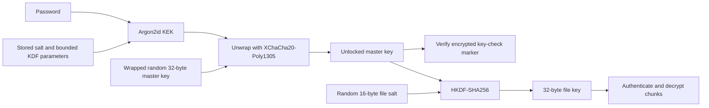
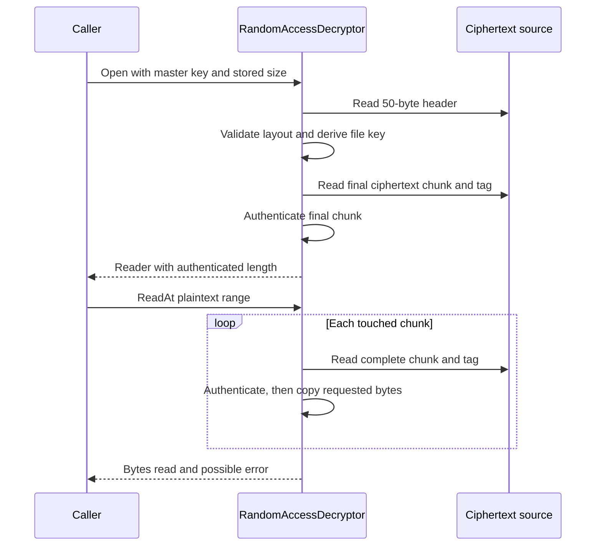

# Encryption and authenticated reads

TDrive encrypts personal-drive file contents with a password-unlocked master key.
The security boundary includes the stream format, channel-scoped key access,
and teardown of consumers when the vault locks. See [media playback](media-streaming.md)
for the consumer pipeline and [mounting](transfers-and-mounts.md) for filesystem ownership.

## Key hierarchy and ownership

The [vault primitives](../../backend/crypto/vault.go) treat Telegram and local
Telegram caches as untrusted storage for content confidentiality. The password
stays on the device; the master key is stored wrapped and loaded into process
memory after unlocking.



Default Argon2id parameters are 64 MiB, three iterations and four lanes. The
parser bounds incoming parameters before the expensive derivation: memory is
16–256 MiB, iterations 1–10, lanes 1–16, salt length 16–64 bytes, and key length
exactly 32 bytes. JSON is limited to 1,024 bytes; unknown fields and trailing
values are rejected. Legacy records without a KDF field select Argon2id.

The wrapped master-key envelope is `24-byte nonce | 32-byte ciphertext | 16-byte tag`.
A separate encrypted `tdrive-key-check-v1` marker verifies the unwrapped key.
Authentication failures can mean a wrong password **or tampered key material**;
the exposed `ErrWrongPassword` does not distinguish those causes.

The [encryption service](../../backend/services/encryption/service.go) publishes
vault configuration and owns the unlocked session key. Changing the password
rewraps the **same master key** with new password-derived material; it does not
rewrite every encrypted file or rotate the underlying content key.

`LoadedMasterKey` returns an owned copy, and
[`MasterKeyLease`](../../backend/services/encryption/key_lease.go) owns an
independent copy. `Key()` makes another defensive copy. Consumers must clear
copies and close leases; clearing the service alone does not revoke already
issued copies. Buffer clearing is best effort, not a promise to erase every
runtime, operating-system or consumer copy of plaintext.

The personal encryption drive is distinct from the currently browsed drive.
`RequireMasterKeyForChannel` rejects encrypted shared-drive reads before cache
access; a cached rendition must not bypass this check.

## Exact TDE1 layout

[`stream.go`](../../backend/crypto/stream.go) is the format authority. Offsets
below are zero based; the fixed header is 50 bytes.

| Offset | Bytes | Meaning |
| --- | ---: | --- |
| 0 | 4 | ASCII `TDE1` |
| 4 | 1 | Reserved flags; must be zero |
| 5 | 1 | Plaintext chunk size exponent; must be 16 |
| 6 | 16 | Random file salt for HKDF-SHA256 |
| 22 | 20 | Random nonce prefix |
| 42 | 8 | Plaintext size, unsigned little endian |
| 50 onward | Variable | Chunk ciphertext followed by a 16-byte tag per chunk |

The file subkey uses HKDF info `tdrive/file/v1`. Each nonce is the 20-byte prefix
followed by a big-endian 32-bit chunk counter. **Bit 31**, the high bit, marks the
final chunk; normal counters stay below that bit. AEAD calls use no additional
authenticated data. The header is validated structurally, and its salt, nonce
prefix and length determine the authenticated chunk layout.

For valid plaintext length `L`, chunk size `C = 65,536`:

```text
chunk count     = floor(L / C) + 1
ciphertext size = 50 + L + 16 * chunk count
chunk i offset  = 50 + i * (65,536 + 16)
final index     = floor(L / C)
final length    = L mod C
```

A partial last chunk carries the final marker. Empty files and exact multiples
of 64 KiB instead require an **empty final chunk with a tag**. Thus a zero-byte
file occupies 66 bytes and a 65,536-byte file occupies 65,618 bytes.
`ValidatePlaintextSize` accepts at most `2^47 - 1` plaintext bytes. Call
`CiphertextSize` and the validator in implementation code rather than copying
this arithmetic; nonce layout and final-marker changes require format versioning.

## Authentication during open and range reads

[`RandomAccessDecryptor`](../../backend/crypto/random_access.go) accepts a
cancellable ciphertext reader plus the stored object's size. Opening it checks
the header, exact ciphertext length and final chunk before returning a usable
reader. This detects a wrong key or truncated tail before a handle is published.



Open does not authenticate untouched interior chunks. Each range authenticates
whole touched chunks before copying bytes from that chunk. A multi-chunk read
may return earlier authenticated bytes plus an error on a later chunk; callers
must honor the returned count and error. Similarly, `DecryptStream` may have
written authenticated earlier chunks before discovering truncation or a final
length mismatch. Successful completion is required to accept the whole stream.

The random-access reader retains a derived file key, not the master key, and
uses at most one chunk-sized ciphertext buffer per read. `Close` cancels linked
reads, waits for them, clears the retained key and rejects future reads. `Clone`
copies authenticated metadata and the file key for another source without
re-reading the header or tail; it is for the same stream, not arbitrary objects.

## Vault transitions and publication races

The [engine](../../backend/core/engine.go) combines a generation counter with a
publication gate. Encrypted [media setup](../../backend/media/service.go) records
an even generation, then performs potentially slow setup outside the gate.
Before publishing, it acquires the read gate and requires the generation to
remain unchanged and even. A stale prepared session is closed and rejected.

`ClearEncryptionSession` takes the write gate, increments to an odd generation,
closes encrypted media sessions, clears the service key, then increments back to
even before releasing the gate. Both checks are necessary: key clearing alone
cannot stop a request that already copied the old key from publishing afterward.

The [GUI vault lifecycle](../../internal/app/vault_session.go) and
[daemon vault lifecycle](../../backend/daemon/server_session.go) hold the mount
lifecycle gate through mount closure and key clearing. This prevents a concurrent
mount start from acquiring a lease in between. GUI lock allows up to 55 seconds
for the transition. After detachment, GUI teardown closes encrypted native media,
revokes gallery images and stops photo backup before clearing the engine session.
If detachment fails, the key remains available to the existing mount.

## Failure boundaries and threat limits

| Condition | Behavior or boundary |
| --- | --- |
| Unsupported KDF or malformed vault material | Reject before Argon2 derivation/decryption |
| Wrong key, missing final tag or stored-size mismatch | Random-access open fails |
| Corrupted interior chunk | Read fails when that chunk is touched |
| Lock races with media setup | Generation check rejects stale publication |
| Mount cannot detach | Lock fails; retain key rather than break active filesystem I/O |
| Caller retained a copied key or plaintext | Lifecycle cleanup must own its release; service clear alone is insufficient |
| Namespace metadata, replay, deletion, whole-stream substitution | Outside TDE1 v1 guarantees |

TDE1 protects encrypted contents and stream length. It does not authenticate the
plaintext namespace/control metadata or bind a complete valid stream to one file
identity. Substituting another valid ciphertext within the same encrypted drive
is outside the [documented threat model](../../backend/crypto/vault.go).

Encrypted rendition caches store ciphertext. Their
[rendition envelope](../../backend/services/file/rendition_envelope.go) binds
parent, channel, class and dimensions; local encrypted thumbnails also have cache
identity checks. These separate protections do not add identity binding to TDE1.

## Existing regression coverage

| Concern | Source tests |
| --- | --- |
| KDF validation and wrapping | [vault tests](../../backend/crypto/vault_test.go) |
| Framing, final marker and size arithmetic | [stream tests](../../backend/crypto/stream_test.go), [size tests](../../backend/crypto/ciphertext_size_test.go) |
| Boundary reads, tampering, cancellation, clones and close | [random-access tests](../../backend/crypto/random_access_test.go) |
| Key ownership and policy refresh | [lease tests](../../backend/services/encryption/key_lease_test.go), [policy tests](../../backend/services/encryption/policy_test.go) |
| Publication after a generation change | [encrypted media tests](../../backend/media/service_encrypted_test.go) |
| Mount/key ordering and failed eject | [GUI lifecycle tests](../../internal/app/mount_lifecycle_test.go), [GUI mount tests](../../internal/app/mount_test.go), [daemon lifecycle tests](../../backend/daemon/mount_lifecycle_test.go) |
