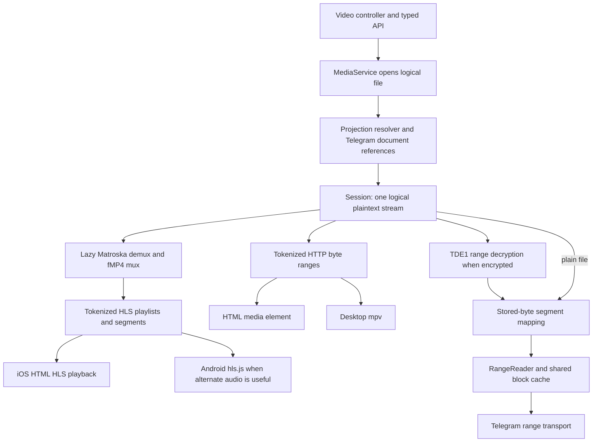
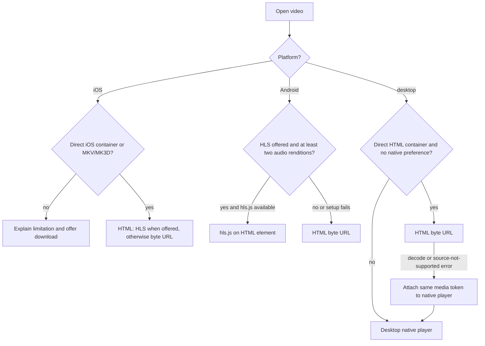
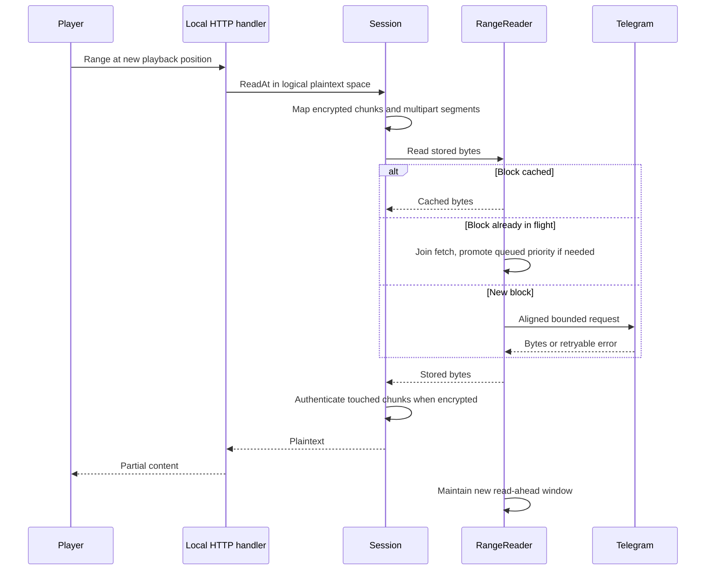
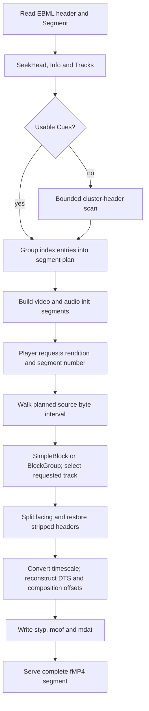
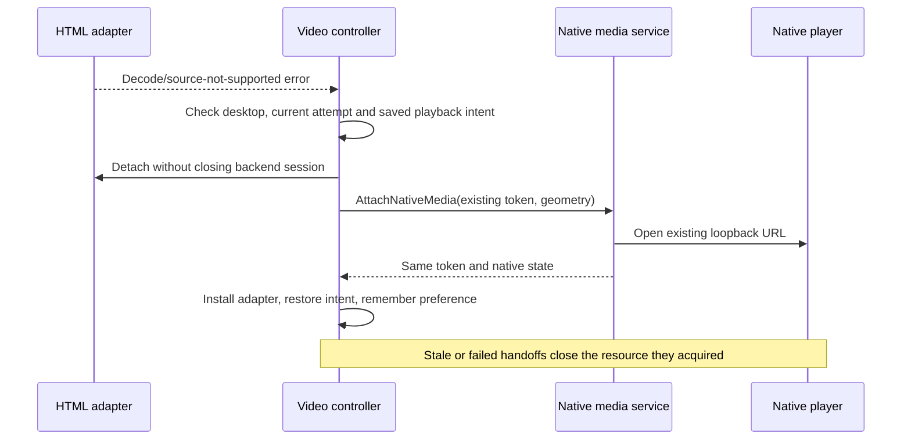

# Media streaming, playback and remuxing

This document follows a file from projected metadata to decoded playback. It
covers the byte transport, platform routing, Matroska demuxing, fMP4/HLS output,
track switching and teardown. File recognition, container support and codec
support are separate decisions; a recognized extension does not guarantee playback.

Reading paths: [routing](#format-admission-and-platform-routing),
[byte transport](#logical-reads-multipart-boundaries-and-encryption),
[remux codecs](#remux-codec-and-track-contract),
[demux and timing](#demux-indexing-and-fmp4-construction),
[player handoff](#track-switching-and-player-handoff) and
[seek previews](#seek-previews-and-bandwidth-sharing).
Photo browsing and original-image ownership are covered in the
[gallery architecture guide](../../frontend/src/ui/gallery/README.md).

## System map

Primary entry points are [the video controller](../../frontend/src/modules/modals/video.ts),
[frontend media API](../../frontend/src/api/media.ts), [Wails media service](../../internal/app/media.go)
and [`media.Service`](../../backend/media/service.go). The
[resolver](../../backend/media/resolver.go) validates projected content and
multipart completeness before constructing an ordered logical file.

## Joined Telegram channel sources

The Channels area connects broadcast channels already joined by the current
Telegram account, including archived dialogs. Connection metadata is local and
keyed by account ID and channel ID. It keeps the channel's access hash and its
small profile photo, so the sidebar shows avatars without a network request;
opening a channel notices a new photo and clears the stored one. Disconnecting
removes that metadata and revokes its media sessions; it never leaves the
Telegram channel. Channel messages are read directly from Telegram and never
parsed as TDX control operations or inserted into the TDrive drive projection.

[`channelsource.Service`](../../backend/channelsource/service.go) checks
membership and content protection with one `channels.getChannels` lookup by
the stored access hash; only a channel added before access hashes were kept
needs a dialog walk, once. The first page and every individual open look the
channel up again. Older pages reuse a lookup up to a minute old, because an
open rechecks before anything plays. Pages are newest first, scan at most four
batches of up to 100 Telegram messages, and continue from the oldest raw
message ID.
Search uses Telegram's channel message search; it is scoped to searchable post
text/captions rather than a locally indexed filename library. The initial
supported media are document-backed video and audio recognized by the player;
recognized container names do not guarantee that a device can decode their
codecs. Other media are unavailable in this first channel-source version.

An external open supplies explicit account, channel, message and connection
generation IDs, independent of the active TDrive drive. It builds one
[`LogicalFile`](../../backend/media/types.go) directly from the Telegram
document reference, then uses the existing tokenized byte ranges, cache,
HTML/native player handoff and optional HLS remux. It creates no fake projected
file. A file-reference refresh re-reads the source post and accepts a new
reference only when the document identity and size still match, preventing
blocks from different document revisions from mixing in one session.

Channel-level or post-level noforwards, paid media, expiring documents and
unsupported formats cannot be opened in-app; the UI offers a Telegram post
link. External media responses use `no-store`, and generated video thumbnails
remain in session temporary storage. Disconnect, logout and normal session
close revoke the loopback URL. Native player processes attached to those
tokens close at the same boundary. Protection or membership changes after a
session has opened are rechecked when an expired reference is refreshed;
existing cached blocks can remain playable until session close, so the first
open's permission check and prompt revocation are the primary boundary.

## Format admission and platform routing

The backend [extension/MIME table](../../backend/media/server.go) recognizes
these video containers for streaming:

| Family | Extensions |
| --- | --- |
| ISO media / QuickTime | `.mp4`, `.m4v`, `.mov`, `.qt` |
| WebM / Matroska | `.webm`, `.mkv`, `.mk3d` |
| MPEG transport / program streams | `.ts`, `.m2ts`, `.mts`, `.mpeg`, `.mpg` |
| Other recognized containers | `.avi`, `.flv`, `.wmv`, `.ogv` |

The same service recognizes audio such as MP3, M4A, AAC, WAV, FLAC and Ogg,
plus PDF, text and selected image formats through other viewer paths. MIME
classification is not a codec probe. The video opener requires video kind;
`OpenStream` serves the broader set. Image originals have additional
[header, size and animation admission](../../backend/media/image_admission.go).

Frontend admission is intentionally narrower in places. The source of truth is
[`media-types.ts`](../../frontend/src/modules/media-types.ts), together with
`openVideoTarget` in the video controller:

| Platform | Initial choice | Fallback / limitation |
| --- | --- | --- |
| macOS desktop | HTML for MP4/M4V/MOV/WebM/OGV unless native is remembered; native for other recognized video containers | HTML decode/source errors may promote to mpv; native requires the compiled runtime and enabled platform support |
| Windows desktop | Same initial routing | Native has a different embedded layout because HTML cannot reliably paint over its child window |
| Linux desktop | Same initial routing | Native requires cgo and a supported display; X11 embeds, Wayland uses a standalone window |
| Android | HTML with the original byte URL | For MKV/MK3D, hls.js is selected when supported and the remuxed master exposes at least two audio renditions; failed setup falls back to direct playback |
| iOS | HTML: direct MP4/M4V/MOV/QT, HLS for MKV/MK3D | Other containers are refused before opening a session and offer download; no desktop native fallback |

Native playback uses the platform implementations in
[`backend/nativeplayer`](../../backend/nativeplayer), including build tags and
platform kill switches. It is not a universal decoder on every device. The
HTML-direct list also expresses a preference, not proof that every codec inside
those containers is supported by the installed WebView.

See [player adapters](../../frontend/src/modules/video/player-adapters.ts),
[hls.js selection](../../frontend/src/modules/video/hls-source.ts) and
[native preference memory](../../frontend/src/modules/video/native-memory.ts).
Network and aborted HTML errors do not trigger native promotion.

## Logical reads, multipart boundaries and encryption

A [Session](../../backend/media/session.go) owns resolved Telegram segments,
readers, optional decryptors, the remux instance and thumbnail work. Byte offsets
presented to a player are plaintext offsets. For encrypted files the decryptor
maps touched plaintext chunks into ciphertext reads, authenticating each chunk
before returning its bytes. Stored-byte reads can cross several Telegram part
messages. See [Encryption](encryption.md) for the format and publication gate.

The [RangeReader](../../backend/media/range_reader.go) splits reads on 1 MiB
Telegram boundaries with 4 KiB alignment. A latency-sensitive opening read uses
a 256 KiB prefix before filling the complete block. Cache hits avoid network work;
concurrent callers for an in-flight block join its existing fetch. If foreground
playback catches up with queued speculation, the fetch can be promoted. A seek
cancels unclaimed obsolete read-ahead rather than leaving the old window ahead
of the new playhead.

| Resource | Current behavior |
| --- | --- |
| Playback byte cache | 64 MiB per session by default |
| Playback read-ahead | Eight blocks; speculative work uses background capacity |
| Original image byte cache | 8 MiB with no read-ahead |
| HTTP streaming buffer | 256 KiB chunks |
| Shared getFile limits | 12 total, with four reserved for playback and at most eight background requests |
| Reference refresh | Deduplicated refresh of expired Telegram document references |
| Block retry policy | Bounded FLOOD_WAIT and transient retries; cancellation terminates the caller's wait |

These are transport budgets, not total player memory limits. The WebView, mpv,
remux output and image/video decoders have separate allocations. The limiter
lives in [`getfile_limiter.go`](../../backend/tgclient/getfile_limiter.go).

Startup overlaps a tail-block fetch with the opening read. The
[MP4 index warmer](../../backend/media/mp4_index.go) also inspects a bounded
number of top-level atoms and speculatively warms up to 16 blocks after media
data. It maps plaintext offsets through encryption and part boundaries. This is
best-effort acceleration; correctness must not depend on the hint succeeding.

## Why the remuxer emits HLS

The [HLS server](../../backend/media/hls.go) offers an HLS URL only for `.mkv`
and `.mk3d`. The Matroska parser can recognize EBML `matroska` and `webm` document
types, but that does not make `.webm` an HLS-routed extension.

Repackaging is useful when the player can decode the elementary streams but
cannot demux the original container. An on-demand progressive fMP4 file would
need a byte-addressable output index whose fragment sizes are not known before
muxing. HLS instead advertises durations and named segments; seeking can select
a source region without first converting the entire file.

Remuxing keeps compressed frames and rewrites container/timing structures.
There is no audio/video re-encoding or full converted-file output on disk.
Unsupported codecs require another player or download, not an automatic transcode.

## Remux codec and track contract

[`codecs.go`](../../backend/media/remux/codecs.go) defines the implemented
copy paths. This table describes the remuxer, not a guarantee about every
hardware decoder, codec profile or OS version.

| Matroska track | fMP4 entry | Preparation |
| --- | --- | --- |
| H.264 / AVC | `avc1` | Decoder configuration from CodecPrivate |
| H.265 / HEVC | `hvc1` | Preserve HEVC configuration; use the hvc1 entry |
| AAC | `mp4a` | AAC configuration |
| AC-3 | `ac-3` | Probe first syncframe to construct `dac3` |
| E-AC-3 | `ec-3` | Probe first syncframe to construct `dec3` |
| FLAC | `fLaC` | STREAMINFO configuration |
| ALAC | `alac` | ALAC configuration |
| MP3, DTS, TrueHD, Opus, Vorbis | Not carried | Deliberately excluded from this remux path |
| Other video codecs | Not carried | No implemented copy path |
| Embedded subtitles | Not carried | No subtitle-to-WebVTT rendition conversion |

`carry` selects the first playable video and all playable audio tracks. The
playable audio track with the most channels becomes the initial choice, with
file order breaking ties; remaining playable tracks retain their order. A file
with genuinely no audio can play video-only. A file with audio but no supported
audio track returns `ErrNoPlayableTrack` instead of silently removing all sound.

## Demux, indexing and fMP4 construction

1. [`Probe`](../../backend/media/remux/matroska.go) follows SeekHead references
   to metadata and Cues when possible. Missing/unusable Cues trigger a cluster
   scan capped at 20,000 entries; a final fallback may use the first cluster as
   one long segment. Missing Cues therefore degrade seeking and memory behavior;
   they are not invariably rejected immediately.
2. [`PlanSegments`](../../backend/media/remux/plan.go) groups indexed cluster
   regions around a six-second target. Real cue spacing determines durations,
   so six seconds is not a maximum. Published durations reflect the plan.
3. [`Stream.Open`](../../backend/media/remux/stream.go) builds per-rendition init
   segments. AC-3/E-AC-3 need first-segment sample reads to recover configuration;
   opening is not always just two small metadata reads.
4. `File.Samples` walks the chosen interval and selected track. It handles
   SimpleBlock and BlockGroup, signed relative timestamps, no/Xiph/fixed/EBML
   lacing and header stripping. Other content compression/encryption encodings
   are refused. A block payload is capped at 64 MiB; string/binary metadata
   values read into memory are capped at 1 MiB. This is not a general EBML
   container-size limit.
5. [`AssignDecodeTimes`](../../backend/media/remux/dts.go) reconstructs decode
   times from presentation timestamps while retaining decode order. This matters
   for B-frames: copying PTS into DTS can cause stalls, judder or timing drift.
   [`fmp4.go`](../../backend/media/remux/fmp4.go) writes durations, sync flags and
   composition offsets. Audio is anchored to its own first sample rather than
   the nominal video boundary to avoid repeated gaps at segment joins.

One planned source interval can require many `ReadAt` calls and Telegram block
requests, including across multipart boundaries. Do not equate one HLS segment
with one Telegram RPC. The remuxer retains track samples and the complete muxed
output for a requested rendition segment; it does not cache completed segments.
The byte cache may reuse source data across audio/video requests, but mux work
can repeat. There is no documented global remux-memory cap: large/poorly indexed
segments and concurrent requests can consume more than the 64 MiB byte cache.

## HLS routes and error handling

All routes share the existing session token:

| Suffix under `/media/hls/<token>/` | Meaning |
| --- | --- |
| `index.m3u8` | Master playlist with one video variant and alternate audio |
| `v/index.m3u8`, `a0/index.m3u8`, ... | VOD rendition playlist |
| `<rendition>/init.mp4` | Decoder configuration |
| `<rendition>/<number>.m4s` | Requested rendition's fMP4 segment |

Playlists use fMP4 initialization maps and advertise a finite VOD presentation.
The session lazily prepares one remux instance under a lock. Successful setup is
reused; failed setup is not permanently cached. Named HLS resources are served
whole, including HEAD handling, rather than as byte-range resources.

Unsupported remux features or absence of playable audio yield HTTP 415. Other
remux failures yield 500; cancellation stops work. Bad tokens, rendition names
and segment paths are rejected. Preserve the distinction between a format
limitation and a temporary read failure in UI messages and retry behavior.

## Track switching and player handoff

Direct HTML track choices depend on the element's exposed audio/text tracks.
The Android hls.js adapter exposes alternate audio renditions; its subtitle API
does not create subtitle tracks that the backend remuxer never published.
Desktop mpv exposes its own normalized track list. Native commands validate
track IDs and subtitle-off values. Standalone native windows own their controls;
HTML track controls apply to HTML and embedded-native modes.

[`SerialPlaybackTransitions`](../../frontend/src/modules/video/playback-lifecycle.ts)
uses generations to reject late opens after navigation/close. Native state events
are routed by token and sequence so startup events can arrive before an adapter
is installed. HTML close removes listeners/source, destroys hls.js and closes
the session; native close also shuts down the native player. Closing a session
cancels range work, thumbnail workers and decryptors. Vault lock closes encrypted
sessions while preserving unrelated clear-media sessions.

## Seek previews and bandwidth sharing

[Video thumbnails](../../backend/media/video_thumbnails.go) use a background
reader with the session's shared byte cache and a separate scheduler. A persistent
mpv extractor may keep container state warm. Playback buffer reports control
precomputation: start full-speed work at 30 seconds buffered, leave that mode
below 20 seconds, and defer even hover work below the eight-second emergency
threshold. A sparse anchor pass precedes coarse/fine timeline filling; flood
waits pause background work.

Generated encrypted-video frames are plaintext in private session temporary
files, not in the persistent thumbnail cache. Session close removes them, and
startup sweeps abandoned directories. This differs from encrypted photo
rendition caches, which store ciphertext. Do not collapse those two policies.

## Local access boundary and validation

The media HTTP server binds `127.0.0.1` on an ephemeral port. Random-token URLs
are bearer capabilities; encrypted media and image streams use `no-store`.
The server permits CORS and relies on loopback plus token possession. The
[gallery binary server](../../backend/galleryimage/server.go) additionally has
Host validation and different admission limits. Closing/revoking sessions is
part of access control, not just memory cleanup.

Existing tests include [HLS routes](../../backend/media/hls_test.go),
[real remux fixtures](../../backend/media/remux/stream_test.go),
[Matroska/lacing/index handling](../../backend/media/remux/matroska_test.go),
[fMP4 timing](../../backend/media/remux/fmp4_test.go),
[DTS reconstruction](../../backend/media/remux/dts_test.go),
[range scheduling](../../backend/media/range_reader_window_test.go),
[encrypted multipart reads](../../backend/media/service_encrypted_test.go),
[player transitions](../../frontend/src/modules/video/playback-lifecycle.test.ts)
and [native handoff](../../internal/app/native_media_test.go). Fixtures establish specific
cases; real-device decoder support and playback memory still need measurement.
