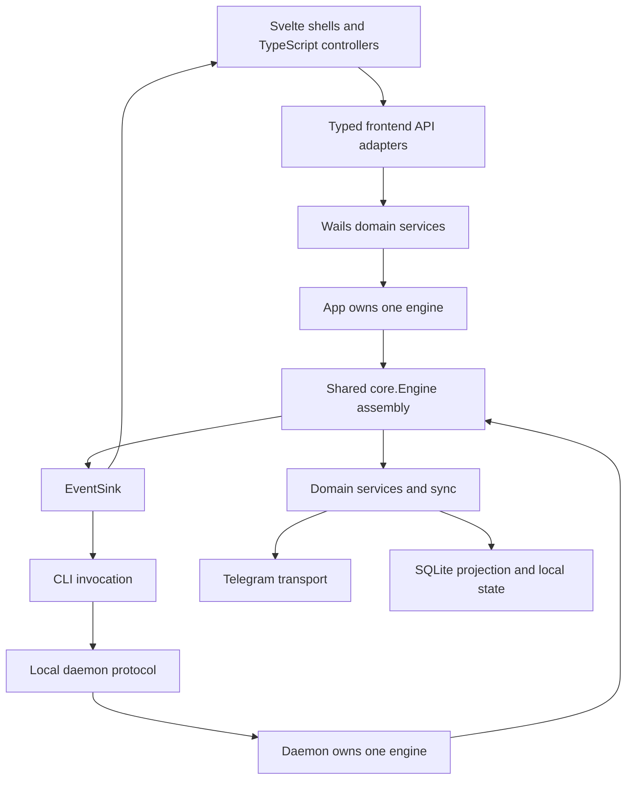
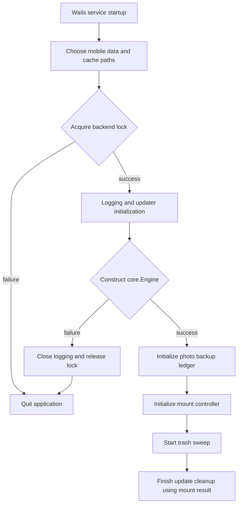

# Runtime and platforms

## One backend assembly

[`core.Engine`](../../backend/core/engine.go) is the headless composition root
shared by the Wails app and CLI daemon. It constructs domain services, the
Telegram adapter, synchronization and media services. Its `EventSink` interface
keeps Wails and terminal presentation out of backend services. A failed Telegram
connection produces a warning and leaves the engine usable offline; failed
cache cleanup, database initialization or schema setup prevents construction.

GUI and daemon are alternative backend owners. Both acquire the same
[`processlock`](../../backend/processlock) before using account state. The GUI
quits if acquisition fails; daemon startup returns the error. A feature must use
the owner's engine instead of constructing another connection and service graph.
Photo backup belongs to the GUI application lifecycle and is assembled outside
`core.Engine`; sharing the engine does not make the daemon a backup scheduler.

The default Telegram adapter installs live-update handling. Injecting a custom
connect function or a prebuilt adapter bypasses that installation, so tests and
alternate hosts must not assume they also started live synchronization.

## GUI startup and shutdown

[`App.ServiceStartup`](../../app.go) owns the sequence below. Wails methods in
[`app_services.go`](../../app_services.go) are grouped by domain and receive a
narrow `serviceHost`. They can be called before construction completes, so their
existing unavailable-backend checks remain part of the bridge contract.

Photo-backup initialization and mount-controller initialization failures are
logged without discarding the constructed engine. Mount construction remains
retryable. The updater receives the mount initialization result so a failure
keeps the prior installation available for rollback instead of completing
successful-update cleanup prematurely.

Shutdown in the same file follows dependency order:

1. Shut down the mount controller with a bounded context.
2. Stop trash sweeping and close native media and gallery image sessions.
3. Stop and close photo backup, including its worker and ledger.
4. Close the engine, which stops live sync, media service and Telegram transport.
5. Close logging and release the backend process lock.

Vault locking and logout have their own mount and encryption ordering. They must
not pull a key out from under a live mount; see [Encryption](encryption.md).
A drive switch also stops photo backup before changing the engine's active drive,
preventing an old scoped worker from following the newly selected destination.

## Frontend ownership and readiness

The application is hybrid, with Svelte owning substantial rendered surfaces.
[`main.ts`](../../frontend/src/main.ts) supplies an application lifecycle to
[`AppRoot`](../../frontend/src/ui/app/AppRoot.svelte). Startup waits for the API
gateway, applies native platform/theme/text-scale state, connects auth events,
activates backup on the dashboard, and initializes the session. Root rendering
covers startup, authentication, loading, dashboard and fatal-error states.

`AppRoot` chooses the desktop or mobile shell when startup finishes, after the
bridge can identify the platform, and keeps that choice for the session.
[`FeatureLayer`](../../frontend/src/ui/app/FeatureLayer.svelte) connects feature
controllers while the dashboard is active and releases their effects on teardown.
TypeScript modules continue to own orchestration, transport and media lifecycle;
Svelte components render stores and invoke typed callbacks. The
[UI foundation](../../frontend/src/ui/README.md) records these boundaries.

[`frontend/src/api.ts`](../../frontend/src/api.ts) is the public frontend API;
its domain adapters wrap generated bindings. The
[`gateway`](../../frontend/src/api/gateway.ts) preserves bridge rejection causes.
[`app_operation.go`](../../app_operation.go) separates stable operation error
codes from display messages. Branch on codes, never translated error text.
Some APIs have different result shapes; inspect the adapter before assuming
every call uses the operation envelope.

## CLI and daemon lifetime

The [daemon](../../backend/daemon/server.go) owns the Telegram session, unlocked
vault, mount controller and persisted CLI working directory. A CLI invocation
is a client of that process: even `pwd` and `cd` round-trip to daemon state.
The protocol is newline-delimited JSON with a version on each request; a mismatch
fails explicitly, including when an upgraded CLI finds an older daemon running.

Login, upload and download stream until their connection ends. Events are bounded
and delivered with nonblocking sends; overflow drops progress updates instead of
stalling a transfer. Streaming transfers are serialized because backend progress
has no request ID for attributing concurrent streams. Separate locks protect
remote writes, persisted shell state and mount/encryption transitions; replacing
these with one global lock would also block otherwise concurrent reads.

Unix transport uses a `0600` socket inside a UID-checked `0700` directory. Windows
uses a named pipe with an ACL granting only the current user's SID. Preserve
these controls when changing transport. Daemon shutdown closes the listener,
stops the mount, waits for handlers, closes the engine and releases the lock.

## Platform storage and execution

| Platform | Runtime storage | Host responsibilities |
| --- | --- | --- |
| Desktop | Shared backend data/cache helpers and process lock | Native window, mount integration, running-process backup scans |
| Android | Wails storage path overrides both data and cache before engine construction | App-private files, MediaStore access, foreground-service execution grant |
| iOS | Wails storage path overrides data; cache stays in the app container's `Library/Caches` | Scoped folder bookmarks, native media and limited UIKit background time |

Mobile tasks compile the shared frontend and mobile Go libraries, with native
Android/iOS hosts around them. They do not package a desktop executable. Follow
the [build guide](../../build/README.md) and platform Taskfiles for those entry
points; OS mounts and desktop updater controls are omitted from the mobile shell.

Mobile photo discovery and staging require the foreground WebView. A granted
native lease can finish an already active transfer after backgrounding, but the
Go worker refuses to start another item until foreground resume. Native expiry
and conservative Go deadlines stop that work: 20 seconds after backgrounding on
iOS, and an Android deadline measured from the first lease acquisition at 5 hours
50 minutes. Reacquiring the Android lease does not reset that elapsed budget.
These are application cancellation bounds, not guaranteed OS execution time.

The lease state and cancellation policy live in
[`app_photo_backup_background.go`](../../app_photo_backup_background.go); the
[frontend background coordinator](../../frontend/src/modules/photo-backup/background.ts)
records the lease only after native acquisition. This is not a headless scheduled
uploader and does not continue after process termination. See the
[backup contract](../../backend/photobackup/README.md) for native discovery bounds,
receipt recovery and source-specific restrictions.

## Existing regression coverage

These are source references, not a claim that this documentation change ran them:

- [App startup](../../app_auth_startup_test.go) and
  [core service wiring](../../backend/core/engine_file_service_test.go).
- [Daemon protocol versions](../../backend/daemon/protocol_version_test.go),
  [agent contracts](../../backend/daemon/agent_contract_test.go) and
  [mount lifecycle](../../backend/daemon/mount_lifecycle_test.go).
- [Frontend API boundary](../../frontend/src/api.test.ts),
  [application shell](../../frontend/src/ui/app-shell.dom.test.ts) and
  [backup background handling](../../frontend/src/modules/photo-backup/background.test.ts).
