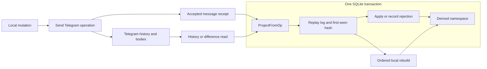
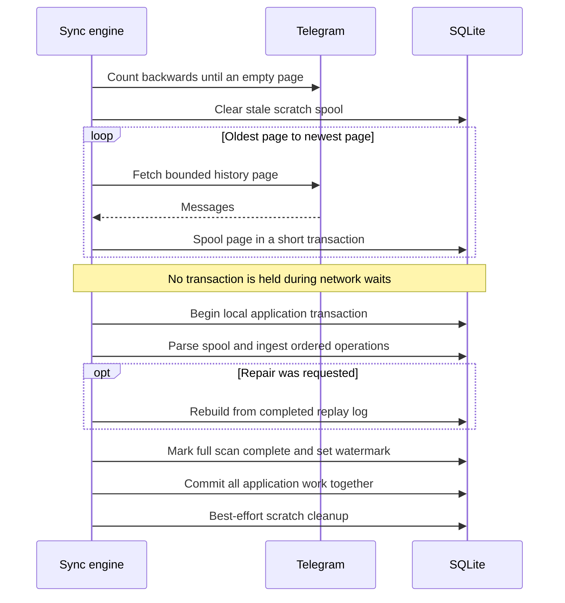

# Storage and synchronization

TDrive stores file bodies and filesystem operations in Telegram messages. SQLite
provides the local namespace and records what this client has observed. Reading
the namespace, observing complete history and completing a remote write are
separate guarantees; the boundaries below determine when each can be trusted.

## What is authoritative

| State | Purpose | Recovery constraint |
| --- | --- | --- |
| Telegram documents and control messages | Remote bodies and operation history | A locally failed write may already exist here |
| `replay_log` | First observed operation, raw header, hash and actor for each message | Preserve it when rebuilding the namespace |
| Files, folders, revisions, directory entries and renditions | Derived namespace and content relationships | Rebuild from ordered replay, through the projector |
| Channel watermarks and authority markers | Describe history coverage and pending repair | A high message ID alone does not prove complete history |
| Mount journal and cleanup plans | Local evidence for uncertain commits and owned bodies | Preserve until reconciliation or cleanup finishes |
| Initial-scan spool | Temporary history pages awaiting atomic application | Discard stale rows and reread on a new full scan |

The [`projection`](../../backend/projection) package owns ingestion and derived
state. SQLite is therefore more than a disposable listing cache: deleting the
database also removes first-seen evidence and local recovery records. Remote
history cannot reconstruct the original caption of a message edited before a
fresh client first saw it.

The root file list also reads a bounded page of Telegram history for unmanaged
attachments. Those rows are not namespace entries: shared-drive sync does not
automatically adopt ordinary chat attachments. Their previews use the
[read-only media fallback](media-streaming.md), independent of sync watermarks.
Before listing or opening a raw message, indexed ownership checks exclude
projected files, tombstones, retained content, multipart parts, renditions and
durable cleanup records. This prevents old bodies from reappearing as new files.

## Ingestion, rejection and tamper evidence

[`ProjectFromOp` and `ProjectFromOpTx`](../../backend/projection/log.go) insert
replay evidence and apply the operation in the same transaction. The first owns
its transaction; the second participates in a caller's page or batch transaction.
Local actions and synchronization share this boundary. Direct namespace writes
would bypass its idempotency and validation rules.

Message identity is `(channel_id, msg_id)`. Observing that identity again leaves
the projection unchanged. A different SHA-256 raw-header hash updates
`replay_log_tamper`, while the first observed operation remains canonical here.
This detects an edit relative to this client's evidence; it neither signs the
message nor guarantees that every client first saw the same caption. Writable
operations also carry operation IDs, allowing repeated publication under
different message IDs to resolve to one operation outcome.

A structurally readable operation can still be rejected by namespace rules.
Cycles, name or revision conflicts, missing objects and incomplete content are
recorded in rejection/outcome tables, allowing later history to proceed. Database
or other unexpected application errors fail the transaction. Consequently,
"message recorded" and "requested namespace change applied" are different facts;
mounted commits inspect the operation outcome before reporting success.

## Send first, project second

[`core.Engine`](../../backend/core/engine.go) sends a control operation and then
projects its receipt. Telegram acceptance and SQLite commit are separate events.
A positive message ID may accompany a local projection error. Synchronization can
then ingest the accepted message without publishing another logical mutation.

For batches, remote messages are sent individually before one local projection
transaction. A failure can therefore leave a remote prefix even when no local
batch projection committed. Local atomicity does not make the remote batch atomic.
Stable Telegram random IDs protect automatic retries within the send operation;
callers must retain the distinction between send failure and projection failure.

## Coverage, ordering and authority

[`sync.Engine`](../../backend/sync/sync.go) serializes initial, incremental and
authoritative work with a per-channel gate. Queued callers can cancel without
waiting for another scan's network calls or FLOOD_WAIT. Cancellation affects
only the caller's admission; the active scan retains its own context and gate
until it finishes. Deletion reconciliation and hard-delete preparation use the
same gate. These channel fields have distinct meanings:

| Field | Meaning |
| --- | --- |
| `last_synced_msg` | Contiguous scanned history boundary, including messages that yield no TDrive operation |
| `pts` | Telegram channel-difference cursor, used when both it and the watermark are usable |
| `initial_sync_done` | A completed full-history observation has committed |
| `needs_projection_rebuild` | Known ordering/coverage repair is still required |

A local operation can already be projected at message 150 while the contiguous
watermark is 100. Reading 101–150 fills that gap. If ingestion encounters an
already-recorded operation above the watermark, it durably marks repair and
rebuilds the completed replay log before reporting successful incremental sync.
This restores ordering when an earlier operation changes how a later one applies.
A previously pending repair escalates the next pass to a full scan.

With usable `pts`, [channel differences](../../backend/sync/difference.go) fetch
new messages and deletion IDs. Each page commits new operations, watermark and
`pts` together. A `TooLong` response falls back to history. Without usable `pts`,
the engine samples it before the history scan, so subsequent differences can
cover arrivals during the scan; failure to obtain it leaves history scanning
available.

History planning walks backwards to discover page boundaries, then reads and
applies oldest first. Only an empty page proves exhaustion: short pages can occur
because of deleted messages or service events. Pagination that makes no progress
fails. Reads use bounded flood-wait retries, and the scan fixes an upper bound so
new arrivals do not continually extend that pass.

## Full scans and local rebuilds

`EnsureAuthoritative` runs an incremental refresh only when full-history authority
already exists and no repair is pending. Otherwise it scans from message zero.
This matters for [encryption policy](encryption.md): absence of a policy is only
meaningful after complete history has been observed. `InitialSyncEmptyChannel`
additionally refuses an existing replay log or namespace.

The [spool](../../backend/sync/initial_scan_spool.go) bounds in-memory history
while leaving the database available between network calls. It is scratch, not a
restart checkpoint: the next full scan clears abandoned rows and rereads history.
Cancellation or failure before the application commit does not grant authority
or leave a partially applied initial scan. Scratch cleanup failure after commit
is logged without incorrectly reporting that the successful scan failed.

[`RebuildProjection`](../../backend/projection/rebuild.go) needs no Telegram
round trips. It clears derived tables and reapplies replay rows in ascending
message order, using keyset batches of 256 inside one atomic transaction. It
preserves replay evidence, recreates incomplete hard-delete plans and retains
completed cleanup receipts. It cannot discover operations absent from the log.
Bounded memory does not mean constant runtime or disk use: a large rebuild still
holds the database connection and can grow the WAL.

[`TuneSQLite`](../../backend/storage_sqlite.go) uses WAL, `synchronous=NORMAL`,
foreign keys, a five-second busy timeout and one pooled connection. Any transaction
holding that connection blocks other local queries, which is why network waits
belong outside it. Increasing pool size also requires moving connection-specific
pragmas into connection initialization.

## Live signals and deletion recovery

[`livesync.Coordinator`](../../backend/livesync/coordinator.go) receives channel
IDs as change signals and schedules authoritative reads. It does not apply update
payloads directly. Defaults are a 750 ms debounce, a five-minute periodic backstop
and a two-minute timeout per pass. Flushes are sequential; a failure waits for a
later signal or backstop instead of immediately retrying. The backstop covers
lost signals and continuously arriving updates that keep resetting the debounce.

Telegram-side deletion of any backing part makes the logical multipart file
unreadable. Differences map deleted IDs to live files and emit tombstones; the
history fallback can run `ReconcileDeletions` to check backing-message existence.
Deletion tombstones are emitted **after** the difference page transaction, and
individual failures are logged. The successful difference path marks deletions
current and skips the redundant existence check, so the cursor transaction must
not be described as an atomic commit of all deletion reconciliation work.

| Failure or observation | Persisted consequence | Recovery behavior |
| --- | --- | --- |
| Remote send succeeds, projection fails | Telegram message can outlive local failure | Sync ingests the message; do not assume it needs republishing |
| Initial scan stops during network reads | Scratch pages may remain; authority is unearned | Next full scan discards scratch and rereads |
| Incremental page application fails | That page and its checkpoint roll back | Resume from the last committed watermark |
| Local operation overlaps newly scanned history | Repair marker survives until rebuild succeeds | Ordered replay repairs the namespace before successful sync |
| Same message has an edited header | First operation retained; tamper evidence updated | Inspect the edit without replacing canonical local evidence |
| Live sync fails or drops a signal | No immediate coordinator retry | A subsequent signal or periodic backstop schedules another pass |

## Source and regression map

- Ingestion and replay: [log tests](../../backend/projection/log_test.go),
  [rebuild tests](../../backend/projection/rebuild_test.go) and
  [writable replay](../../backend/projection/writable_apply_test.go).
- Coverage and authority: [incremental tests](../../backend/sync/sync_test.go),
  [difference tests](../../backend/sync/difference_test.go),
  [authority tests](../../backend/sync/authoritative_test.go) and
  [truncated-history tests](../../backend/sync/truncated_history_test.go).
- Availability and scheduling: [connection-hold tests](../../backend/sync/connection_hold_test.go)
  and [live coordinator tests](../../backend/livesync/coordinator_test.go).
