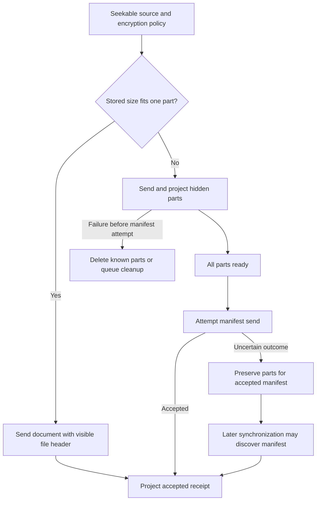
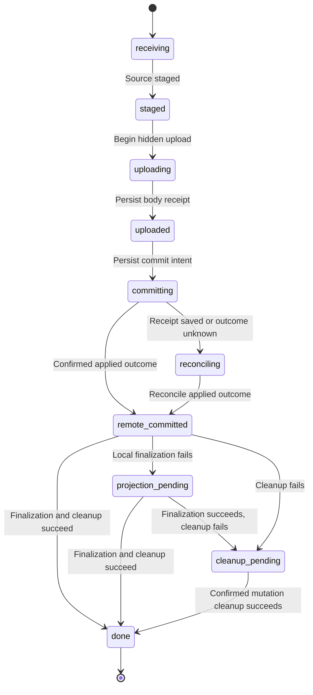
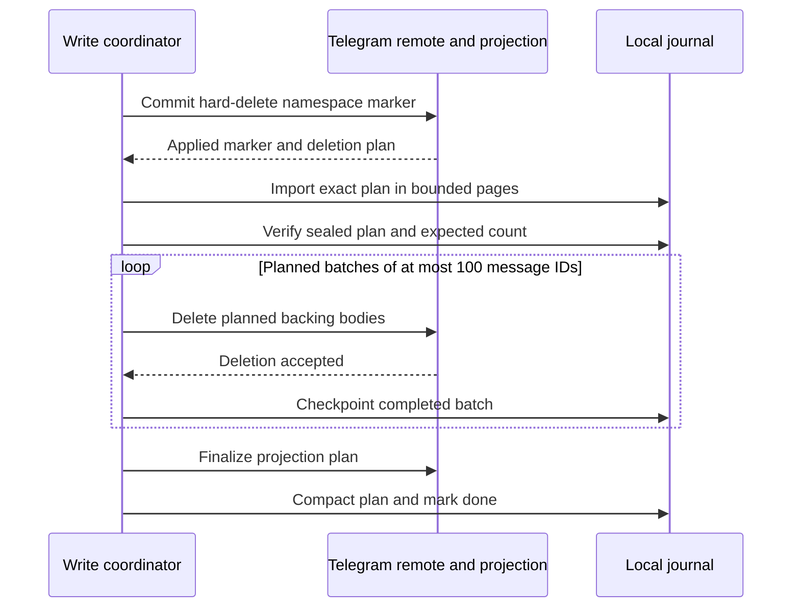
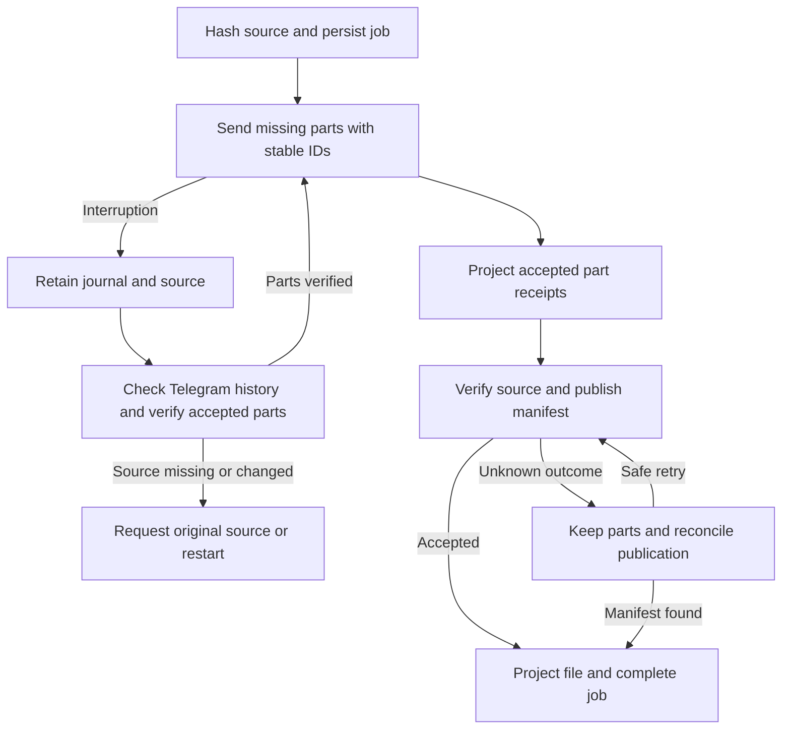

# Transfers and mounted writes

The file service owns ordinary uploads and downloads. Mounted writes add durable
operation identity, staging, namespace preconditions and recovery because an HTTP
request may end before its remote outcome is known. These paths share Telegram
transport primitives but have different publication and recovery boundaries.

## Upload shapes and visibility

The [file service contract](../../backend/services/file/service.go) and
[upload implementation](../../backend/services/file/upload.go) choose the storage
shape using stored bytes, including encryption overhead.

| Shape | Publication boundary | Error consequence |
| --- | --- | --- |
| Ordinary single document | Telegram accepts the document containing the file header | Local projection can fail after the remote file exists |
| Ordinary multipart file | Telegram accepts a manifest referencing previously hidden parts | Once manifest send is attempted, preserve parts even if the outcome is unknown |
| Resumable multipart file | The same manifest boundary, with a durable local job and verified part receipts | Keep checkpoints and reconcile uncertain sends before continuing or discarding |
| Mounted content write | A separate writable commit references uploaded hidden bodies | Reconcile the journaled operation before deciding whether bodies are disposable |

The current [limits](../../backend/services/file/limits.go) are 1900 MiB per
stored part, 40 GiB per stored logical file and a defensive maximum of 32 parts.
These are application limits, applied uniformly; an encrypted file can cross a
part boundary because its stored size exceeds its plaintext size.

The diagram below describes the ordinary upload path. Eligible unencrypted
uploads use the durable recovery path described below instead of aborting their
parts after an interrupted attempt.

Part messages use hidden `OpFilePart` records; they are not independent user files.
Ordinary multipart uploads stage encrypted data one part at a time. If a failure
occurs before manifest send, cleanup deletes known part receipts and queues failed
body deletions for later sweeping. After send is attempted, even cancellation can
hide acceptance, so abort cleanup would risk destroying a committed file.

Automatic retries preserve a stable Telegram random ID per operation and step,
and rewind seekable bodies before retrying. Multipart upload requires an
idempotent sender. The ordinary single-document uploader's identity lasts for
that call; it has no durable operation journal. Preserve the shared upload
semaphore across GUI, import, backup and mount callers.

## Downloads publish completed output

[`downloadProjectedFileToPath`](../../backend/services/file/download_file.go)
reads an immutable projected revision into a sibling temporary file. It verifies
output length, closes the file and only then replaces the destination. Transfer
failure or cancellation removes temporary output before publication. The
[replacement helper](../../backend/services/file/download.go) first tries rename,
then a backup-and-rename fallback with best-effort rollback; the fallback is not
a crash-atomic transaction. This is not a persistent resume queue.

| Download shape | Transfer and verification |
| --- | --- |
| Single plaintext | Retry into a truncated temporary output using random-access writes; verify final size |
| Single encrypted | Download and size-check a ciphertext temp, then decrypt to final staging |
| Multipart plaintext | Download up to two parts concurrently; size-check each temp before copying to its final offset |
| Multipart encrypted | Download, verify and feed parts in order to one decrypting stream; stage one ciphertext part at a time |

Retries restart the affected download target or part rather than blindly append
to a partial byte stream. Aggregate progress avoids counting retransmitted bytes
twice. Encrypted output also passes authenticated decryption; plaintext size
checks alone are not a cryptographic content-integrity guarantee.

[Folder downloads](../../backend/services/file/folder_download.go) assemble a
private sibling directory and publish it with a rename after success.
[Publication](../../backend/services/file/download_staging.go) checks for a
conflicting destination again before rename. This narrows a race; the code does
not implement an atomic filesystem "rename only if absent" primitive.

## The mounted write transaction

[`mountcontroller/writer.go`](../../backend/mountcontroller/writer.go) connects
WebDAV to the mount adapter, protocol-neutral coordinator, SQLite journal, local
staging and Telegram remote implementation. The
[`Coordinator`](../../backend/mountwrite/operations.go) serializes conflicting
namespace/object operations and retains revision preconditions through commit.
A WebDAV preflight check alone cannot replace these checks.

This diagram shows the content-write success and uncertainty path. Abort cleanup
and hard-delete states are covered below. The
[journal](../../backend/mountwrite/journal.go) retains mutation parameters, staged
source references, hidden-body receipts and remote commit references. Transitions
check the expected prior state so competing recovery cannot silently overwrite it.

[`TelegramRemote.Commit`](../../backend/mountadapter/remote.go) derives a stable
send ID from the operation ID, publishes the control message, persists its receipt
and projects it. It then checks `projection_operations`: acceptance by Telegram
is insufficient if namespace validation rejected the mutation. Receipt-aware
recovery can fetch that exact message. Without a receipt, reconciliation checks
local outcomes and a bounded history search for the operation ID; finding nothing
in that search does not prove that publication never happened.

Hidden upload uncertainty is also significant. A body may have been accepted
before its receipt could be durably recorded. The coordinator retains staging
while [hidden receipt recovery](../../backend/services/file/hidden_upload.go)
reconstructs exact cleanup ownership. Deleting whatever messages happen to look
like unused parts is not a valid recovery strategy.

## Recovery and hard deletion

Adapter construction runs [`Coordinator.Recover`](../../backend/mountwrite/recovery.go).
The current behavior is state dependent:

| Durable state or failure | Recovery action | What must remain available |
| --- | --- | --- |
| `receiving`, `staged`, `uploading`, `uploaded` | Abort precommit work and clean hidden bodies; do not publish a resumed write | Staging and exact receipts until cleanup ownership is established |
| `committing` | Reenter the stable commit path | Original operation ID, mutation and body |
| `reconciling` | Resolve receipt or operation ID; remain pending if not found | Journal and referenced bodies |
| `remote_committed`, `projection_pending` | Finish local finalization and invalidation | Confirmed result and journal |
| `cleanup_pending` | Retry stage/body cleanup; finish as done or aborted according to outcome | Ownership receipts and cleanup metadata |
| Hard-delete plan/body/finalization states | Continue the recorded deletion plan | Sealed plan and completed batch checkpoints |

Temporary `ErrUnavailable` during hidden cleanup or an already committed hard
delete is retained as pending without blocking the whole mount. Validation,
corruption and commit-state recovery failures remain fatal. A request error must
not cause blanket journal/staging deletion: a remote mutation may already depend
on that record for reconciliation.

Ordinary file-service deletion creates trash operations. Mounted WebDAV deletion
uses the [hard-delete coordinator](../../backend/mountwrite/hard_delete.go), which
reports success only after planned body deletion and finalization finish.

The marker remains a namespace resurrection barrier during ordered replay.
The coordinator imports plan pages of 500 IDs, checks that the plan is complete,
and deletes only its recorded bodies. A remote deletion followed by a failed
local checkpoint is safe to repeat because Telegram body deletion is idempotent.
See [storage and synchronization](storage-and-sync.md) for the ordering repair
required when local commits are ahead of the contiguous history watermark.

## Large upload recovery

Individual, unencrypted file uploads larger than 2,000,000,000 bytes use the
[upload journal](../../backend/services/file/resumable_upload.go) and
[recovery runner](../../backend/services/file/resumable_run.go). This eligibility
threshold is separate from the 1900 MiB multipart boundary. Encrypted uploads,
folder imports, photo backup and downloads keep their existing paths.

The journal scopes jobs to the account and channel and records source identity,
whole-file and per-part hashes, the part plan and the history boundary before
upload. Confirmed progress comes from durable part receipts. Bytes in a partially
sent part do not count as a completed checkpoint.

Resume verifies the selected source and accepted remote parts before sending
missing parts. It does not continue an unfinished Telegram document at a byte
offset. An uncertain manifest must be reconciled before deciding whether its
parts are disposable. Discard removes only parts verified to belong to the job.

The frontend can retry `waiting_network` jobs while the app is active and visible;
uncertain publication and changed-source states require their recovery controls.
Interrupted active jobs become paused when a new service instance opens the
journal. Reopening the app does not imply unrestricted background execution.

On Android and iOS, [app staging](../../internal/app/upload_staging.go) retains eligible
picker sources in private app storage for unfinished jobs. Cleanup checks journal
references before removing copies; startup can sweep unreferenced staging left
before a job was saved. iOS excludes these source copies from device backup.

## WebDAV range assembly

The [WebDAV Content-Range handler](../../backend/mountdav/writes.go) implements a
specific macOS client behavior: follow-up PUTs send
`Content-Range: bytes start-end/total`. The
[resume store](../../backend/mountdav/resume.go) accumulates these chunks in
private temporary files keyed by resource path. It can seed a new sequence from
already committed content when that content's size exactly matches `start`.

Non-final chunks return 204 after buffering and never reach the coordinator.
The final chunk passes the assembled source through the ordinary mounted `Put`
path with a fresh operation ID. Ranges must continue at the accumulated offset.
Changed totals or lock tokens discard the old sequence and require reseeding
from committed content. Invalid syntax returns 400, an offset
conflict 409, and size/quota rejection 413.

Defaults are an 8 GiB per-object cap, 16 GiB aggregate reservations and two minutes
of idle retention. Idle cleanup runs lazily on later access; server stop removes
the scratch root. The entry map is process-local, so this is transient chunk
assembly, not durable upload continuation after restart. It is also distinct
from mount-journal recovery, which aborts unfinished precommit uploads.

Encrypted coordinator staging stores ciphertext and excludes transient master
keys from journal JSON. However, Content-Range assembly and unknown-length PUT
buffering happen **before** that staging step and write plaintext temporary files.
Private scratch permissions do not encrypt those bytes. See
[encryption](encryption.md) for the key and staging boundary.

This mechanism is independent of the large-upload journal above. Downloads and
uploads outside that journal's eligibility retain transport retries without
persisted restart continuation. Range reads for media are a separate read path.

## Source and regression map

- Upload outcomes: [retry tests](../../backend/services/file/upload_retry_test.go)
  and [hidden receipt tests](../../backend/services/file/hidden_upload_recovery_test.go).
- Upload continuation: [multipart tests](../../backend/services/file/multipart_test.go)
  and [mobile source ownership tests](../../internal/app/share_test.go).
- Download publication: [file tests](../../backend/services/file/download_file_test.go),
  [publication tests](../../backend/services/file/download_publish_test.go) and
  [folder tests](../../backend/services/file/folder_download_test.go).
- Mounted durability: [remote tests](../../backend/mountadapter/remote_test.go),
  [recovery tests](../../backend/mountwrite/recovery_test.go),
  [hard-delete tests](../../backend/mountwrite/hard_delete_test.go) and
  [Content-Range tests](../../backend/mountdav/resume_test.go).
