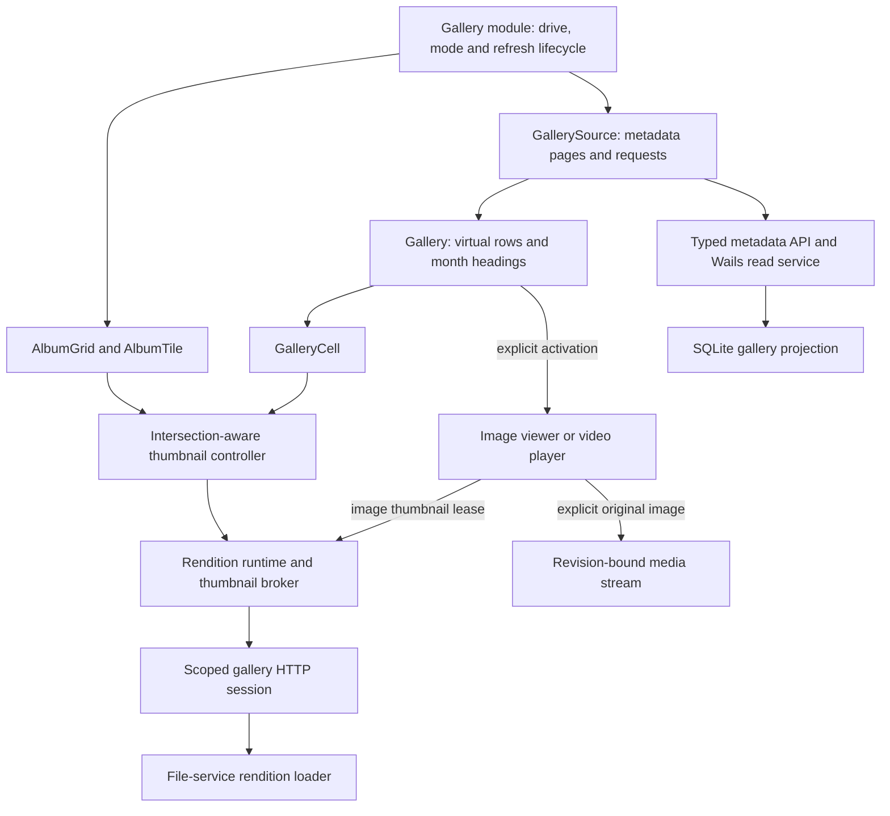
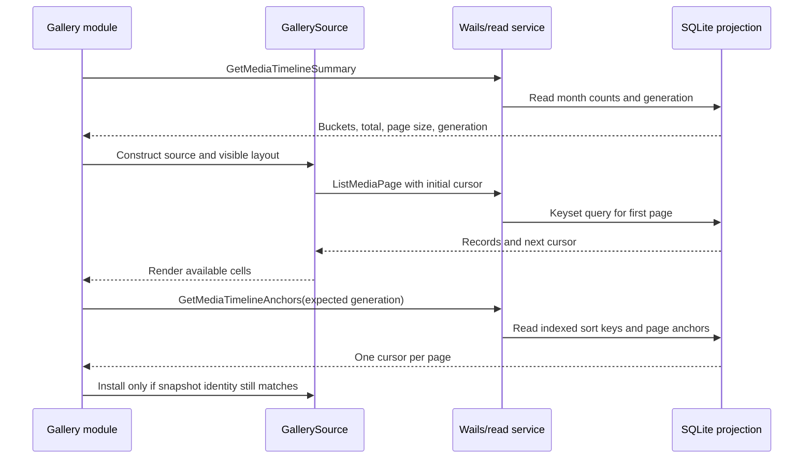
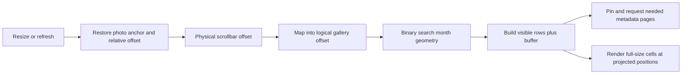
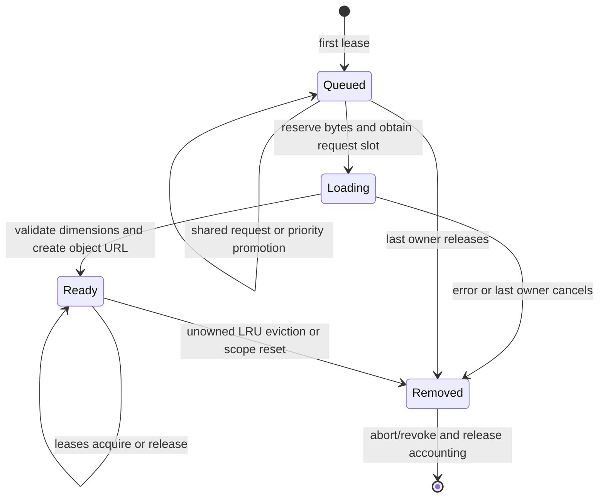
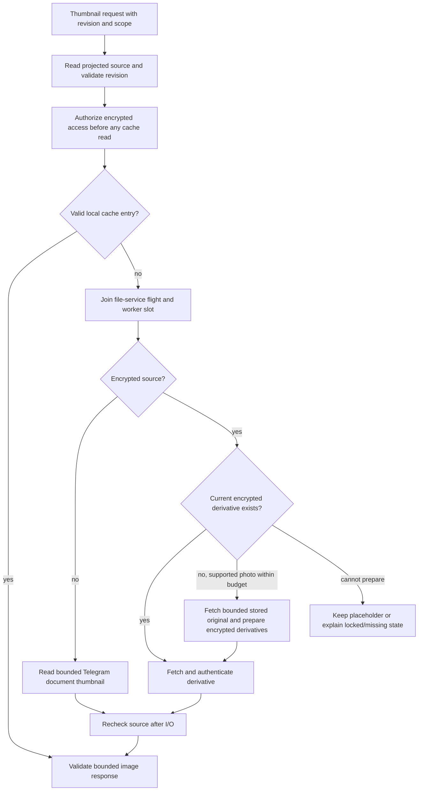
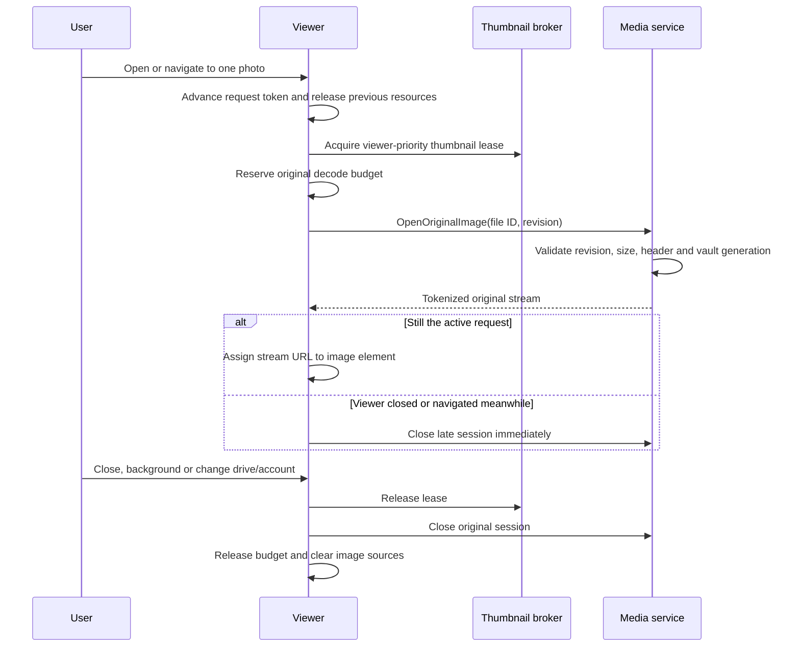

# Gallery architecture and performance contract

The gallery shares its metadata source, Svelte surfaces and image broker across
desktop, Android and iOS. An 8 GB phone is the intended mobile baseline, not a
verified memory guarantee. This guide explains the algorithms and ownership
boundaries behind large libraries, encrypted thumbnails and original viewing.

Reading paths: [metadata](#metadata-summary-first-anchors-second),
[virtual layout](#virtual-layout-and-the-browser-height-limit),
[albums](#albums-are-a-different-navigation-cost),
[image ownership](#thumbnail-identity-leases-and-scheduling),
[budgets](#budgets-and-environmental-policy),
[derivative loading](#binary-transport-and-backend-rendition-selection) and
[original viewing](#explicit-original-viewing-and-teardown).
Video playback has a separate [media architecture guide](../../../../docs/architecture/media-streaming.md).

## Layers and ownership

The [gallery module](../../modules/gallery.ts) owns entry, mode changes, refresh
and teardown. [GallerySource](gallery-source.ts) owns metadata, not image bytes.
[Gallery.svelte](Gallery.svelte) owns visible layout; cells register with the
[thumbnail controller](../renditions/thumbnail-controller.ts). The
[rendition runtime](../../modules/renditions/runtime.ts) scopes image access by
account and drive. The [image viewer](../../modules/modals/preview.ts) owns its
active original stream. No component should independently cache the entire
library or take ownership of another layer's object URLs.

## Metadata: summary first, anchors second

Gallery reads use the SQLite projection; opening Photos does not start a remote
original-library download. [Projection gallery tables](../../../../backend/projection/gallery_schema.go)
maintain the media index, month counts and generation revisions.

Drive-wide startup has two phases:

[`MediaTimelineSummary`](../../../../backend/projection/gallery.go) reads month
summaries so first paint need not wait for an index scan. The anchor builder
uses `ROW_NUMBER()` over descending `(upload_time, msg_id)` order and produces
one cursor per 128 items. The
[timeline LRU](../../../../backend/projection/gallery_timeline_cache.go) coalesces
cold loads, caches up to eight entries and about 4 MiB, and returns snapshots
without caching them when too large.

Cursors encode version, channel, generation, sort key and absolute position.
The generation combines database epoch, channel and projection revision. Each
page opens a short read transaction and rejects a mismatched generation.
[`MediaPage`](../../../../backend/projection/gallery_page.go) seeks from the
indexed key, reading one extra row for the next cursor. It does not use a deep
SQL OFFSET for normal paging or hold a transaction open while the user scrolls.

This splits costs deliberately: full records are bounded, but anchors and month
metadata still grow with the library. A cold anchor generation scans indexed
metadata; the LRU byte cap does not cap an oversized active snapshot returned to
a caller. Do not claim that every part of gallery work is constant-time or
constant-memory with respect to library size.

## Metadata scheduler and stale snapshots

[GallerySource](gallery-source.ts) maintains a page Map in LRU order, one request
per page start, a pinned viewport set and at most two active bridge reads.
`ensureRange` replaces queued viewport intent after scrolling. Explicit viewer
or keyboard requests receive priority. Repeated requests share work, and queued
obsolete viewport requests are discarded instead of accumulating per-row tasks.

| Metadata resource | Current bound / behavior |
| --- | --- |
| Page size | 128 items from the backend timeline |
| Retained full pages | Six mobile / twelve desktop |
| Retained full records | Normally at most 768 mobile / 1,536 desktop |
| Active page reads | Two |
| Pinned viewport pages | At most `maxPages - 1`, leaving room for navigation |
| Queued page intent | Bounded by source page capacity; older intent may be discarded |
| Anchor cache | Eight generations and approximately 4 MiB server-side |

Results are accepted only after checking generation, page start and expected
length. Disposing a source clears listeners/pages and prevents late results
from repopulating it; already-running bridge reads may finish. A stale result
requests a refresh rather than mixing records from different generations.

The module preserves a visible file anchor across drive-wide refreshes with
`LocateMedia`, since new uploads or deletions can shift ordinal positions.
Resize also preserves a photo anchor and its viewport offset. If the anchor was
removed, the controller uses its fallback position. Refresh failures retain an
existing source with a retry message where possible. Album views preserve a
positional anchor because drive-wide ranks are not folder-local ranks.

## Virtual layout and the browser height limit

[`gallery-layout.ts`](gallery-layout.ts) computes geometry per month bucket,
not one row object for every offscreen photo. Binary search finds the month at
an offset, then the window builds visible rows plus two buffer rows per side.
The lookup/window work is approximately `O(log(months) + visible rows)`; building
or resizing the bucket layout still visits the month summaries.

The scroll canvas is capped at 16,000,000 CSS pixels. For physical scroll extent
`P` and logical scroll extent `L`, `logicalOffset = physicalOffset * L / P`
when `P` is nonzero. A cell is positioned using
`physicalOffset + logicalPosition - logicalOffset`. This compresses scrollbar
travel while retaining the cell's actual pixel size. Simply scaling the whole
canvas would shrink photos; using an enormous CSS height would make the library
end unreachable in browsers that clamp element height.

## Albums are a different navigation cost

[`MediaFolders`](../../../../backend/projection/gallery_folders.go) groups direct
media children by parent folder. It returns counts and covers in one query;
branch folders containing only subfolders do not become albums. More than one
media folder selects the folder grid by default; otherwise Photos uses the
single timeline. [AlbumGrid](AlbumGrid.svelte) windows rows through the shared
[file-list row-window helper](../file-list/row-window.ts).

Album covers use the same thumbnail identity and leases as other file surfaces.
Unusable covers, including unsupported/video covers, fall back to a glyph or
locked treatment without blocking navigation.

Folder timelines have month summaries but no precomputed anchor index. The
source learns each `nextCursor` and walks missing pages on a distant jump.
Normal sequential browsing reuses those cursors. A cold jump in a very large
folder can therefore require many page reads; learned cursors grow with pages
visited. Likewise the album query returns folder metadata for all albums even
though DOM rows are virtualized. A viewport-sized DOM does not make these
metadata costs disappear.

## Thumbnail identity, leases and scheduling

The frontend [RenditionBroker](../../modules/renditions/broker.ts) currently
accepts **thumbnail only**: a 512-pixel maximum edge and 1 MiB compressed limit.
Backend preview/original rendition classes still exist, but the current image
viewer uses an original media stream rather than a full-image Blob broker.

A request key contains scope nonce, channel, file ID, revision and rendition kind.
The scope itself includes the authenticated account. Backend cache identity also
includes account/database identity and the selected content/derivative. Never
reuse a DOM image URL as proof of the current file's identity.

Mounted cells register lightweight handles. Intersection with the gallery's
160-pixel root margin acquires a lease; leaving the interest region or unmounting
releases it. The viewer acquires its own lease, so removing a grid cell cannot
cancel an image still owned by the viewer.

The scheduler orders `viewer`, then `visible`, then `prefetch`. Its queue is
small and capped, so it scans for the next priority rather than maintaining a
second heap/index during cancellation. Map delete/reinsert gives LRU touches;
eviction chooses ready entries with no subscribers. The last lease cancels
unfinished work, while ready revision-bound thumbnails can remain cached.
Revision-zero entries are not retained after their final subscriber leaves.

Admission reserves worst-case thumbnail bytes before starting: `512 * 512 * 4`
decoded bytes and 1 MiB compressed. Completion replaces the reservation with
validated actual dimensions/blob size. Canceled running work keeps accounting
until it settles. Metadata/URL count is bounded too, preventing millions of tiny
images from fitting under a byte budget while consuming unbounded bookkeeping.

## Budgets and environmental policy

Values come from [gallery-policy.ts](../../modules/gallery-policy.ts), the broker,
[media image admission](../../../../backend/media/image_admission.go) and the
[thumbnail cache](../../../../backend/thumbnail/cache.go).

| Resource | Mobile | Desktop |
| --- | ---: | ---: |
| Normal thumbnail decoded estimate | 80 MiB | 192 MiB |
| Normal thumbnail compressed bytes | 8 MiB | 32 MiB |
| Memory-pressure decoded estimate | 48 MiB | 96 MiB |
| Memory-pressure compressed bytes | 4 MiB | 16 MiB |
| Normal thumbnail concurrency | 2 | 4 |
| Queue limit | 192 | 448 |
| Broker entry limit | Twice queue limit | Twice queue limit |
| Disposable thumbnail disk cache | 256 MiB | 1 GiB |

Low power or memory pressure reduces concurrency to one; backgrounding reduces
it to zero. Memory pressure also immediately resets image ownership and keeps a
60-second reduced-policy window. The policy's `allowPrefetch` gate requires an
explicitly connected, unmetered, unconstrained foreground session; unknown network
cost disables it. There are currently no production broker acquisitions with
`prefetch` priority. The active viewer opens the selected original and thumbnail
only, and never neighboring originals.

Opening an original reserves 128 MiB decoded and 8 MiB compressed from the
thumbnail policy, with floors of 16/2 MiB. That leaves normal desktop thumbnail
budgets at 64/24 MiB and mobile at 16/2 MiB. These are admission estimates, not
hard bounds on WebView/GPU allocations or total process RSS.

## Binary transport and backend rendition selection

The [runtime](../../modules/renditions/runtime.ts) shares one lazy backend session
promise and broker per image scope. The
[gallery HTTP server](../../../../backend/galleryimage/server.go) binds loopback,
checks Host, uses a random 256-bit token, caps sessions at eight and admits at
most 16 simultaneous requests server-side. Client concurrency and file-service
worker limits apply separately. Bytes travel over HTTP rather than as large
Wails/base64 payloads. Request cancellation reaches the rendition loader.

[`Rendition`](../../../../backend/services/file/rendition.go) authorizes before
cache lookup and coalesces matching work. Plain thumbnails use local cache then
Telegram document thumbnails. Encrypted thumbnails use encrypted sidecars.
**Legacy exception:** when an encrypted image lacks a current sidecar, its thumbnail request
may call `PrepareRemoteRenditionsWithinBudget` and download its stored original,
capped at 30 MiB for both stored/output size. This is lazy, cancellable repair,
not a full-library download, but it means “thumbnails never fetch originals”
would be inaccurate.

Immutable derivative references bind the source content. The
[rendition loader](../../../../backend/services/file/rendition_source.go) checks
size, encryption and decoded bounds; definitively corrupt/missing derivatives
are quarantined. Offline errors and cancellation are not corruption evidence.
The source is checked again after I/O so a concurrent replacement cannot publish
stale image bytes under a current identity. Thumbnail access can include trash;
preview/original rendition access does not inherit that broader lookup.

## Derivative production and durable retry

[Preparation](../../../../backend/services/file/rendition_upload.go) pins an
immutable source, decodes once to a 1600-pixel preview and derives the 512-pixel
thumbnail from that bounded image. Apple/Android native decoders downsample;
other desktop paths use serialized, pixel-limited decoding. Unsupported sources
can retain placeholders without invalidating the original upload.

For encrypted files, each derivative is encrypted with its bound envelope before
persistence. The [outbox](../../../../backend/projection/rendition_outbox.go)
queues both kinds before sending, with at most 128 jobs and 64 MiB of payloads
across the table. Workers fetch bounded job IDs and then one payload at a time.
Stable send identities allow retry without regenerating ciphertext or reopening
the original. An uncertain old intent must be reconciled before forgetting it.

Descriptors are additive fields on hidden-part operations. Shared-drive
publication requires original-uploader ownership, replaced content cannot reuse
old derivatives, and updated deletion plans include those messages. Old clients
may ignore descriptors and fail to physically delete their blobs; complete
cleanup needs a client that understands the associated history.

## Explicit original viewing and teardown

The [preview controller](../../modules/modals/preview.ts) shows a pinned thumbnail
while opening the selected original. Navigation epochs/request tokens prevent a
slow earlier open from replacing the current image. It uses GallerySource for
neighbors, scanning at most 128 candidates to skip videos; this resolves metadata
until navigation activates the selected item and opens its original. Videos have
their own player path. Original failure can leave the thumbnail visible with an error
and download action.

[`OpenImage`](../../../../backend/media/service.go) checks revision before and
after open. Originals are admitted up to 256 MiB and 32 million pixels, with a
bounded header read, and use an 8 MiB byte cache without read-ahead. GIF originals
and animated WebP are rejected from direct display by the current admission
policy; download remains available. The current viewer does not use the older
16 MiB/16 MP `original` rendition API, so those limits must not be conflated.

Drive/account scope changes, vault lock, backgrounding and memory pressure dispose
broker URLs and revoke backend sessions. Album/timeline mode changes alone do not
create a new image scope, although unmounting releases the affected leases.
A session-expired response can reopen the shared
HTTP session once. Telegram cooldown deadlines are kept separately per account
in a bounded map, so resets cannot bypass flood waits. Source-generation errors,
locked vaults, transport failures and missing derivatives require different UI
states rather than a single endless retry loop.

## Disk storage and failure boundaries

The [disk cache](../../../../backend/thumbnail/cache.go) stores opaque payloads;
callers encrypt entries for encrypted sources. It reserves bytes before temp
writes, bounds entry metadata as well as bytes, and evicts least-recently-used entries.
Failed deletions remain accounted for. Undeletable startup overflow uses counters
rather than retaining an unbounded path index and can prevent new admission.
Initial directory inspection still scales with existing cache files.

Cache cleanup must not remove database/WAL history, rendition send intents,
backup ledgers or user downloads. Projection rebuilds use 256-row keyset batches
inside an atomic transaction; their duration and disk growth still scale with
history. Bounded gallery images do not make all application storage disposable.

## Regression and measurement map

| Concern | Existing coverage |
| --- | --- |
| Paging, anchors, stale results and folder walks | [gallery-source.test.ts](gallery-source.test.ts), [gallery-module.dom.test.ts](gallery-module.dom.test.ts) |
| Geometry, scroll cap and resize anchors | [gallery-layout.test.ts](gallery-layout.test.ts), [gallery-mobile.dom.test.ts](gallery-mobile.dom.test.ts) |
| Albums and cover fallbacks | [albums.dom.test.ts](albums.dom.test.ts), [album-view.test.ts](album-view.test.ts) |
| Lease priority, budgets and URL lifetime | [broker.test.ts](../../modules/renditions/broker.test.ts), [runtime.test.ts](../../modules/renditions/runtime.test.ts) |
| Original stream ownership and late navigation | [preview-renditions.dom.test.ts](../../modules/modals/preview-renditions.dom.test.ts) |
| Keyset index usage and bounded timeline cache | [gallery_scale_test.go](../../../../backend/projection/gallery_scale_test.go) |
| Encrypted/remote derivatives and failure handling | [rendition_test.go](../../../../backend/services/file/rendition_test.go), [rendition_failures_test.go](../../../../backend/services/file/rendition_failures_test.go) |
| Binary session isolation and revocation | [server_test.go](../../../../backend/galleryimage/server_test.go) |

[Browser contracts](../../../e2e/app.spec.ts) use a million-photo fixture to check
DOM and metadata-call bounds. They do not prove device memory or frame rate.
Profile long scrolling, rapid jumps, viewer navigation and background/foreground
on Android and iPhone hardware, including memory pressure, constrained networking
and vault lock. Measure cold anchor generation and large-folder jumps separately
from warm scrolling so expensive setup is not hidden in a smooth-scroll result.
